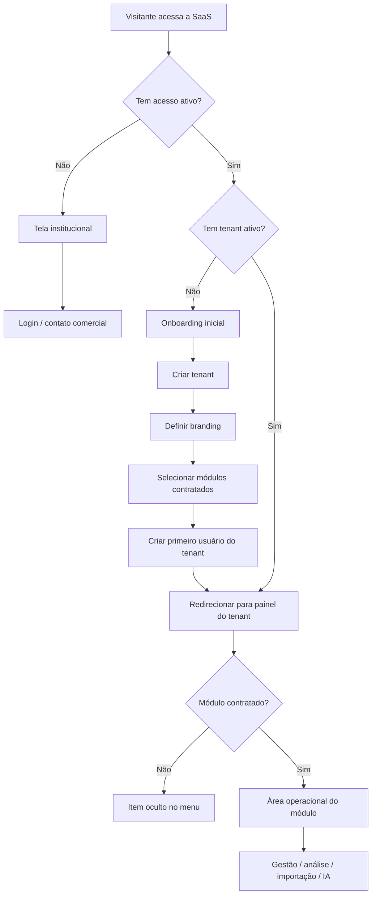
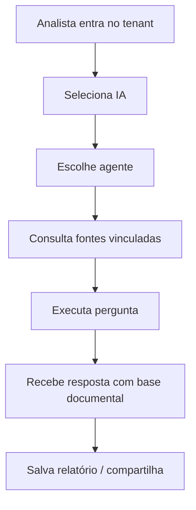
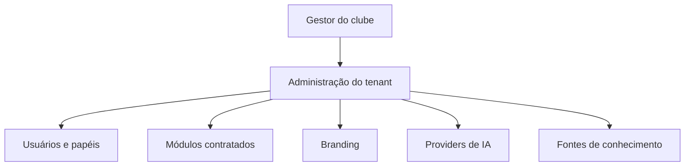
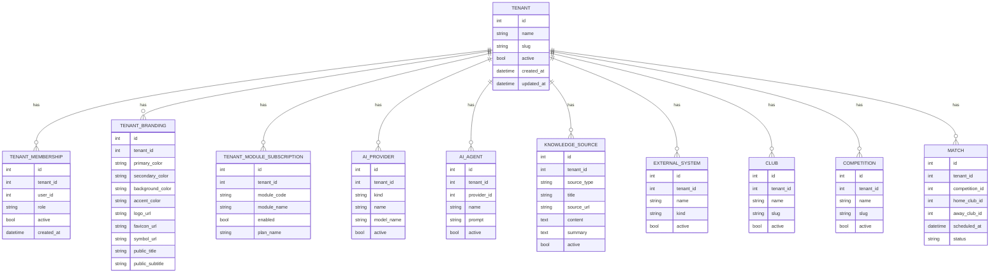
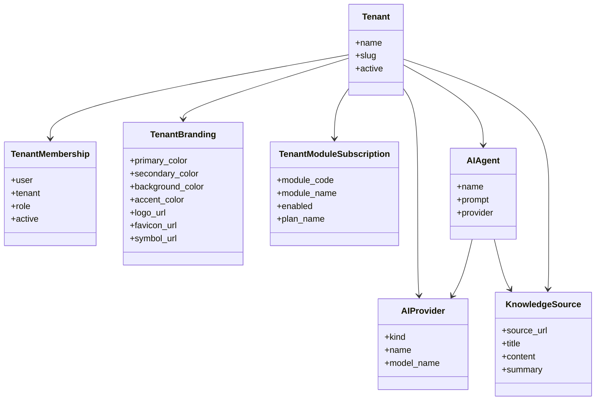

# PRD — SaaS do Futebol White-Label por Tenant

## 1. Visão geral

A SaaS do Futebol é uma plataforma multi-tenant para operação de clubes, com foco em inteligência, gestão, dados e automação. O produto deve permitir que cada clube tenha seu próprio ambiente, identidade visual e conjunto de módulos contratados, mantendo isolamento total de dados entre tenants.

O ponto central do produto é combinar:
- operação esportiva;
- governança e permissões;
- camada de IA e fontes de conhecimento;
- personalização por clube;
- entrega white-label com branding próprio;
- tela institucional pública para visitantes sem acesso.

A primeira entrega alvo é o clube **Avaí**, mas o desenho precisa servir para qualquer clube profissional ou estrutura esportiva que adote a plataforma.

---

## 2. Sobre o produto

O produto é uma plataforma SaaS para clubes de futebol, construída em torno de tenants. Cada tenant representa um clube ou organização contratante. O sistema deve suportar:

- tenant com branding próprio;
- login e onboarding do primeiro usuário do clube;
- módulos contratados por cliente;
- menu dinâmico conforme contratação;
- gestão de usuários, papéis e permissões;
- configuração de providers de IA;
- importação de fontes externas por URL;
- agentes de IA vinculados a fontes;
- dashboards inteligentes e relatórios;
- integrações e automações;
- uso institucional e operacional em um único ecossistema.

A experiência do usuário precisa diferenciar claramente:
1. visitantes sem contrato ou sem acesso ativo;
2. administradores da plataforma;
3. administradores do tenant;
4. gestores e analistas do clube;
5. usuários operacionais com acesso restrito a módulos contratados.

---

## 3. Propósito

### Objetivo de negócio
Permitir que a SaaS seja vendida de forma modular e escalável para clubes, com implantação rápida, personalização visual e acesso controlado por contrato.

### Objetivo de produto
Criar uma plataforma que entregue valor imediato para o clube, sem depender de desenvolvimento customizado por cliente.

### Objetivo operacional
Viabilizar que o fornecedor entregue um tenant já configurado, mas permita que o gestor do clube administre usuários, papéis, fontes e integrações depois do go-live.

---

## 4. Público-alvo

### 4.1. Administrador da plataforma
Pessoa que opera a SaaS como negócio. Pode criar tenants, planos, módulos, branding-base e usuários iniciais.

### 4.2. Gestor do clube
Usuário responsável por administrar o tenant do clube, cadastrar usuários, configurar módulos adquiridos e operar o dia a dia.

### 4.3. Analista de desempenho
Usuário que consome dados, relatórios, fontes externas e IA para gerar análises táticas e operacionais.

### 4.4. Coordenador / diretor / gestor esportivo
Usuário que precisa de visão executiva, aprovações, dashboards, relatórios e status das operações.

### 4.5. Visitante sem acesso
Pessoa que ainda não contratou o produto ou ainda não tem acesso ao tenant. Deve ver a tela institucional e o login.

---

## 5. Objetivos

1. Criar uma experiência white-label por tenant.
2. Permitir contratação modular por área funcional.
3. Exibir apenas os módulos contratados no menu.
4. Criar onboarding inicial do tenant dentro da aplicação.
5. Permitir branding por tenant: logo, cores, símbolos e identidade.
6. Manter a tela pública institucional separada da área operacional.
7. Garantir que IA, integrações e fontes estejam na base mínima do produto inteligente.
8. Permitir importação de fontes externas por URL como fonte de conhecimento.
9. Manter isolamento total entre tenants.
10. Entregar tudo com interface server-rendered em Django Templates + TailwindCSS.

---

## 6. Requisitos funcionais

### 6.1. Camada pública institucional
- Exibir landing page pública para visitantes sem acesso.
- Mostrar marketing do produto, diferenciais, prova social e CTA de login.
- Bloquear acesso à área operacional sem tenant ativo.
- Permitir redirecionamento ao login.

### 6.2. Tenants e onboarding
- Criar tenant com nome, slug e status.
- Permitir onboarding inicial do tenant após primeiro login.
- Permitir associar o primeiro usuário ao tenant com papel inicial.
- Permitir configurar branding do tenant.
- Permitir habilitar módulos contratados.
- Permitir definir layout inicial da navegação por tenant.

### 6.3. Módulos contratados
- Armazenar lista de módulos comprados por tenant.
- Renderizar somente menus contratados.
- Ocultar funcionalidades não contratadas.
- Permitir reconfiguração por plano/contrato.

### 6.4. Usuários e permissões
- Criar usuários por tenant.
- Associar papéis por tenant.
- Restringir acesso por papel e módulo.
- Permitir admin da plataforma e admin do tenant com escopos distintos.

### 6.5. Branding por tenant
- Armazenar logo, favicon, cores e símbolos.
- Permitir cor primária, secundária, fundo e destaque.
- Aplicar branding em navbar, sidebar, botões, formulários e telas públicas.
- Permitir tema Avaí FC como template inicial.

### 6.6. IA e conhecimento
- Permitir cadastro de providers.
- Permitir conexão de múltiplos providers.
- Exibir catálogo de modelos disponíveis por provider.
- Permitir cadastro de agentes de IA.
- Permitir vincular fontes de conhecimento aos agentes.
- Permitir importar fontes por URL.
- Limpar e armazenar conteúdo importado como base de conhecimento.
- Permitir uso de IA para análise, resumo e recomendação.

### 6.7. Integrações e importações
- Registrar sistemas externos e integrações.
- Importar dados do domínio esportivo a partir de arquivos e URLs.
- Permitir cargas iniciais e atualizações posteriores.

### 6.8. Operação esportiva
- Exibir módulos de clubes, pessoas, categorias, competições e partidas.
- Exibir relatórios e indicadores.
- Exibir aprovações, notificações e auditoria.

### 6.9. Tela e menu dinâmicos
- Sidebar retrátil com submenus.
- Menu orientado por módulo contratado.
- Ícone em cada item de navegação.
- Visual consistente com o tenant.

---

## 7. Flowchart mermaid com os fluxos de UX

---

## 8. Requisitos não-funcionais

1. **Segurança**
   - isolamento por tenant em toda consulta;
   - credenciais nunca expostas no front-end;
   - logs sem segredos;
   - controle rígido por papel.

2. **Performance**
   - páginas server-rendered rápidas;
   - listagens paginadas;
   - importação assíncrona onde necessário.

3. **Escalabilidade**
   - suportar múltiplos clubes e módulos sem fork de código;
   - permitir expansão por plano.

4. **Confiabilidade**
   - validações de modelo com `full_clean()`;
   - dados consistentes entre tenant e entidades vinculadas.

5. **Manutenibilidade**
   - arquitetura simples com Django Templates;
   - componentes reutilizáveis;
   - design system baseado em TailwindCSS.

6. **Acessibilidade**
   - contraste adequado;
   - estados de foco visíveis;
   - navegação clara por teclado.

7. **Internacionalização de linguagem**
   - toda interface em português do Brasil;
   - termos consistentes com o glossário do projeto.

---

## 9. Arquitetura técnica

### Visão geral
- **Backend:** Django 4.2
- **Banco:** PostgreSQL
- **Frontend:** Django Templates + TailwindCSS
- **Persistência:** modelo relacional multi-tenant
- **IA:** providers externos e execução local conforme configuração
- **Importação de conhecimento:** páginas públicas por URL e fontes internas
- **Entrega:** containerizada via Docker Compose

### Decisões arquiteturais
- Multi-tenancy por linha com FK `tenant` em modelos sensíveis.
- `Tenant` e `TenantMembership` são a base de isolamento.
- Menus e páginas derivam de permissões + módulos contratados.
- O tenant branding é aplicado no layout base.
- O onboarding inicial é uma camada de negócio, não só configuração de admin.
- A camada institucional é separada da aplicação autenticada.

### Componentes principais
- camada pública institucional;
- autenticação e autorização;
- onboarding do tenant;
- catálogo de módulos;
- branding por tenant;
- IA e fontes;
- operação esportiva;
- relatórios e dashboards;
- integrações.

---

## 10. Stack

### Backend
- Python 3.11
- Django 4.2
- PostgreSQL 16
- Docker / Docker Compose

### Frontend
- Django Template Language
- TailwindCSS
- ícones SVG inline ou biblioteca leve compatível

### Integrações
- providers de IA compatíveis com a arquitetura atual
- importação de URLs públicas
- fontes documentais internas

### Infra local
- ambiente em container
- execução via `make`
- acesso local e rede interna quando habilitado

---

## 11. Estrutura de dados com schemas em formato mermaid

---

## 12. Design system

A interface deve seguir um design system azul inspirado no Avaí FC, com visual limpo, institucional e profissional. Tudo deve ser implementado com **TailwindCSS dentro do Django Template Language**.

### 12.1. Cores primárias
- **Primária:** azul Avaí
- **Secundária:** azul escuro / navy
- **Destaque:** azul claro / sky
- **Neutro:** cinzas frios

### 12.2. Cores de fundo
- **Fundo principal:** branco ou cinza muito claro
- **Fundo secundário:** azul muito suave / slate claro
- **Sidebar:** navy ou azul profundo
- **Cards:** branco com bordas suaves

### 12.3. Botões
- **Primário:** fundo azul, texto branco, hover azul mais escuro
- **Secundário:** contorno azul, fundo branco, hover azul claro
- **Perigo:** vermelho apenas para ações destrutivas explícitas
- **Ação de sucesso:** verde discreto

### 12.4. Inputs e forms
- borda cinza clara;
- foco com ring azul;
- labels curtas e claras;
- estados de erro em vermelho controlado;
- campos agrupados por blocos visuais.

### 12.5. Grids e layout
- grid responsivo com 1, 2, 3 ou 4 colunas;
- cards com altura consistente;
- espaçamento generoso;
- seções bem separadas visualmente.

### 12.6. Menus
- sidebar retrátil;
- submenus por grupo funcional;
- ícone em cada item;
- menu controlado por módulos contratados;
- sem poluição visual.

### 12.7. Fontes
- fonte sans-serif padrão do sistema ou equivalente moderna;
- títulos com peso médio/forte;
- corpo com boa legibilidade;
- hierarquia clara de `h1`, `h2`, `h3`.

### 12.8. Componentes UI
- cards;
- badges;
- tabelas;
- empty states;
- modais de confirmação;
- breadcrumbs;
- alertas;
- tabs;
- formulários divididos por etapas.

---

## 13. User stories

1. Como administrador da plataforma, quero criar tenants, para entregar a SaaS para novos clubes.
2. Como administrador da plataforma, quero definir módulos contratados por tenant, para liberar apenas o que foi vendido.
3. Como administrador da plataforma, quero personalizar cores e logos do tenant, para entregar white-label.
4. Como visitante, quero ver uma tela institucional, para entender o produto antes de logar.
5. Como visitante sem acesso, quero encontrar o login facilmente, para entrar se eu já for cliente.
6. Como primeiro usuário do clube, quero passar por onboarding, para configurar o tenant sem depender de suporte técnico.
7. Como gestor do clube, quero criar usuários e papéis, para distribuir o uso do sistema.
8. Como gestor do clube, quero ativar e desativar módulos contratados, para ajustar o acesso ao contrato.
9. Como gestor do clube, quero configurar branding do meu tenant, para que a interface tenha a identidade do clube.
10. Como analista de desempenho, quero importar uma URL como fonte, para usar conteúdo externo na IA.
11. Como analista de desempenho, quero consultar fontes vinculadas ao agente, para gerar análises confiáveis.
12. Como analista de desempenho, quero escolher um provider e modelo, para adaptar custo e qualidade.
13. Como gestor esportivo, quero ver dashboards inteligentes, para tomar decisão com rapidez.
14. Como gestor esportivo, quero acessar relatórios e indicadores, para acompanhar a operação do clube.
15. Como usuário do tenant, quero ver apenas os menus contratados, para não navegar em áreas que não comprei.
16. Como usuário autenticado, quero que meus dados fiquem isolados por tenant, para não ver informação de outros clubes.
17. Como administrador de plataforma, quero ter uma visão de saúde e uso, para acompanhar adoção e receita.
18. Como clube, quero ter uma tela institucional própria, para parecer um produto profissional e não uma ferramenta genérica.

---

## 14. Épico

### Épico 1 — Plataforma white-label modular por tenant

Entregar uma SaaS em que cada clube tenha identidade própria, módulos contratados e onboarding inicial configurável, com IA e dados como núcleo do produto.

---

## 15. Critérios de aceite

1. Um visitante sem acesso vê apenas a tela institucional.
2. Um usuário com acesso ativo entra na área correspondente ao tenant.
3. Um tenant pode ser criado com branding próprio.
4. O primeiro usuário do tenant pode concluir onboarding inicial.
5. O menu mostra somente módulos contratados.
6. A IA aparece como módulo mínimo obrigatório quando contratada.
7. Providers podem ser configurados por tenant.
8. Fontes podem ser importadas por URL e associadas a agentes.
9. O sistema bloqueia acesso entre tenants.
10. O design é consistente com o tema azul do Avaí FC.
11. A interface funciona em desktop e se adapta a telas menores.
12. O conteúdo sensível não aparece em tela pública.
13. O fluxo é navegável sem depender de front-end SPA.

---

## 16. Métricas de sucesso

### 16.1. KPIs de produto
- taxa de conversão da tela institucional para login;
- taxa de conclusão do onboarding do tenant;
- número de tenants ativos;
- número de módulos ativados por tenant;
- número de fontes importadas por tenant.

### 16.2. KPIs de usuário
- tempo para configurar primeiro tenant;
- tempo para cadastrar primeiro usuário;
- tempo para importar primeira fonte;
- tempo para chegar ao primeiro insight da IA.

### 16.3. KPIs de adoção
- usuários ativos por tenant;
- frequência de uso dos módulos contratados;
- retenção mensal;
- taxa de uso dos dashboards e IA.

### 16.4. KPIs de qualidade
- falhas de importação;
- erros de autorização;
- tempo de resposta das páginas;
- índice de inconsistência de dados por tenant.

---

## 17. Risco e mitigações

### Risco 1 — Escopo excessivo
**Mitigação:** lançar em fases, com módulos mínimos e expansão progressiva.

### Risco 2 — Confusão entre admin da plataforma e admin do tenant
**Mitigação:** separar fluxos, nomenclatura e telas.

### Risco 3 — Menus poluídos e experiência confusa
**Mitigação:** menu modular, retrátil, com submenus e apenas itens contratados.

### Risco 4 — Branding inconsistente por tenant
**Mitigação:** criar uma camada única de identidade visual aplicada no base template.

### Risco 5 — Importação de conteúdo externo frágil
**Mitigação:** limitar importação a fontes públicas específicas, validar HTML e registrar falhas.

### Risco 6 — Vazamento entre tenants
**Mitigação:** reforçar isolamento em ORM, validação de modelo e testes.

### Risco 7 — Produto ficar apenas operacional e pouco inteligente
**Mitigação:** manter IA, fontes e automações como núcleo obrigatório.

---

## 18. Lista de tarefas

### Sprint 1 — Base de produto white-label
- [x] Definir o modelo canônico de tenant, branding e módulos contratados.
- [x] Criar a tela institucional pública.
- [x] Criar o onboarding inicial do tenant.
- [x] Adicionar menu dinâmico por módulos contratados.
- [x] Aplicar branding por tenant no layout base.
- [ ] Criar a primeira experiência do Avaí como tenant piloto.

### Sprint 1.1 — Subtarefas detalhadas
  - [x] Criar o conceito de módulo contratado no banco.
  - [x] Definir a estrutura de branding do tenant.
  - [x] Implementar carregamento do branding no template base.
  - [x] Criar componente de menu lateral com submenus.
  - [x] Habilitar ícones e estados visuais por item de menu.
  - [x] Criar página institucional com marketing e login.
  - [x] Implementar redirecionamento para onboarding quando não houver tenant.
  - [x] Criar formulário de onboarding inicial.
  - [x] Permitir seleção do primeiro papel do usuário.
  - [x] Permitir escolha dos módulos comprados.

### Sprint 2 — Gestão de acesso e operação
- [ ] Criar gestão de usuários por tenant.
- [ ] Criar gestão de papéis por tenant.
- [ ] Criar visão do admin do tenant.
- [x] Garantir que só menus contratados apareçam.
- [ ] Criar telas de configuração do tenant.
- [ ] Criar tela para ativar/desativar módulos.

### Sprint 2.1 — Subtarefas detalhadas
  - [ ] Criar CRUD de usuários do tenant.
  - [ ] Criar atribuição de papéis por usuário.
  - [x] Criar validação de acesso por tenant.
  - [ ] Criar view para listar módulos ativos.
  - [ ] Criar view para alterar módulos contratados.
  - [ ] Criar tela de identidade visual do tenant.
  - [ ] Criar preview visual do branding.
  - [x] Criar componente de aviso de módulo indisponível.

### Sprint 3 — Núcleo de IA inteligente
- [x] Criar gestão de providers por tenant.
- [x] Criar catálogo de modelos por provider.
- [x] Criar agentes de IA por tenant.
- [x] Criar vínculo entre agente e fontes.
- [x] Criar importação de fontes por URL.
- [x] Criar listagem de fontes de conhecimento.

### Sprint 3.1 — Subtarefas detalhadas
  - [x] Criar formulário de provider com chave e modelo.
  - [x] Criar tela para listar providers.
  - [x] Criar tela para editar provider.
  - [x] Criar catálogo de modelos por provider.
  - [x] Criar formulário de agente com provider vinculado.
  - [x] Criar fluxo de importação de URL pública.
  - [x] Extrair título, resumo e conteúdo principal da URL.
  - [x] Salvar fonte importada como conhecimento do tenant.
  - [x] Criar associação de fontes ao agente.
  - [x] Criar execução de perguntas ao agente.

### Sprint 4 — Operação esportiva
- [x] Consolidar clubes, competições, partidas e eventos.
- [x] Exibir relatórios e indicadores.
- [x] Melhorar navegação operacional.
- [x] Garantir isolamento total por tenant.

### Sprint 4.1 — Subtarefas detalhadas
  - [x] Revisar telas de listagem por tenant.
  - [x] Revisar filtros e buscas.
  - [x] Criar cards de indicadores.
  - [x] Criar visão de partidas recentes.
  - [x] Criar caminho de análise operacional.
  - [x] Melhorar empty states e feedbacks.

### Sprint 5 — Dashboards inteligentes e previsões
- [ ] Criar dashboards inteligentes separados.
- [ ] Criar módulo de previsões.
- [ ] Planejar previsões de lesão, próximo adversário e tendência de performance.
- [ ] Criar alertas e automações.

### Sprint 5.1 — Subtarefas detalhadas
  - [ ] Definir visão executiva do dashboard.
  - [ ] Definir visão do analista.
  - [ ] Definir visão da comissão técnica.
  - [ ] Estruturar cartões de previsões.
  - [ ] Mapear fontes para previsões.
  - [ ] Definir gatilhos de automação.
  - [ ] Criar notificações de valor.

### Sprint 6 — Qualidade, segurança e entrega
- [x] Adicionar cobertura de testes para onboarding.
- [x] Adicionar cobertura de testes para branding.
- [x] Adicionar cobertura de testes para menu dinâmico.
- [x] Adicionar cobertura de testes para IA e importação.
- [x] Revisar segurança por tenant.
- [ ] Validar performance em páginas principais.

### Sprint 6.1 — Subtarefas detalhadas
  - [x] Testar criação de tenant com branding.
  - [x] Testar ocultação de menus não contratados.
  - [x] Testar tela institucional sem acesso.
  - [x] Testar onboarding inicial.
  - [x] Testar importação de URL pública.
  - [x] Testar isolamento entre tenants.
  - [x] Testar permissões por papel.
  - [x] Testar respostas da IA por tenant.

---

## 19. Escopo incremental recomendado

### Fase 1
- tenant;
- branding;
- módulos contratados;
- tela institucional;
- onboarding;
- menu dinâmico.

### Fase 2
- IA;
- providers;
- agentes;
- fontes por URL.

### Fase 3
- operação esportiva;
- relatórios;
- dashboards inteligentes.

### Fase 4
- previsões;
- automações;
- integrações avançadas.

---

## 20. Notas finais

Este PRD assume o vocabulário do projeto em português do Brasil e a estratégia de produto definida no brainstorm:

- a SaaS precisa ser white-label por tenant;
- apenas módulos contratados devem aparecer;
- o tenant deve ser personalizável em identidade visual;
- a primeira experiência deve ser institucional para quem não tem acesso;
- a IA e as fontes precisam ser parte do núcleo do produto;
- previsões e dashboards inteligentes podem e devem ser módulos separados.

Este documento deve servir como base para implementação, priorização e evolução do produto.
