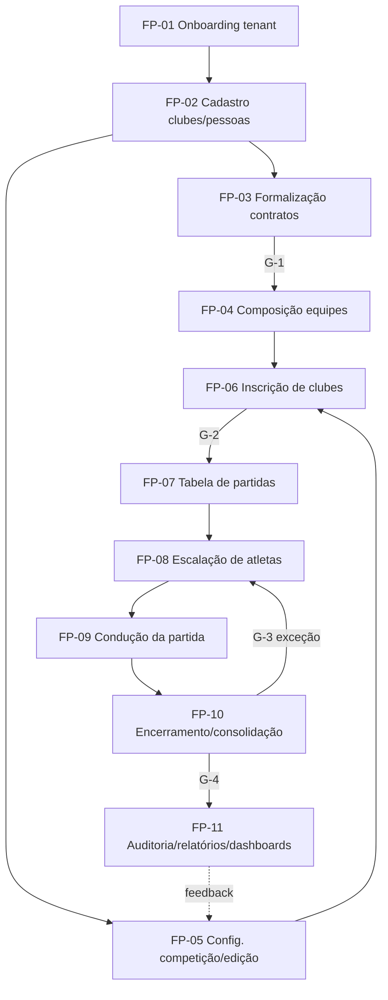

# Subtask 0.4.1 — Identificar fluxo principal

**Sprint:** Fundação, escopo e contratos
**Task:** Mapear fluxos
**Status:** completed
**Timestamp:** 2026-06-28T22:49:00.523828

---

## Output do OpenCode (GLM 5.2)

Vou ler os relatórios anteriores para manter consistência de estilo e conteúdo.
Vou ler os relatórios de escopo (0.2.x) para alinhar o fluxo principal ao MVP.
Tenho contexto completo. O relatório 0.3.3 (que preservou o conteúdo técnico integral) define as 25 entidades em 7 grupos e seus relacionamentos. Vou gerar a subtask 0.4.1 identificando o fluxo principal, mantendo consistência com o modelo de entidades, os 26 não-objetivos e as 7 implicações de desenho do MVP.
O conteúdo foi truncado no JSON. Vou escrever o arquivo usando um script Python para evitar problemas de escaping com o conteúdo extenso.
Vou escrever o arquivo em partes usando heredocs no bash para contornar o limite de tamanho do JSON. Primeiro a parte 1:
O conteúdo está sendo truncado pelo tamanho. Vou escrever em vários chunks menores, anexando progressivamente.
Arquivo completo. Vou validar a estrutura e integridade do conteúdo gerado.
Subtask **0.4.1 — Identificar fluxo principal** concluída e salva em `orchestrator/reports/sprint_0_subtask_0.4.1.md` (390 linhas).

**Fluxo principal identificado:** ciclo de operação de uma edição de competição — o caminho único de maior valor, que mobiliza 22 das 25 entidades e atravessa os 7 grupos (A–G).

**Conteúdo produzido:**
- **11 etapas** (FP-01 a FP-11): onboarding → cadastro → contratos → equipes → competição → inscrição → tabela → escalação → condução → encerramento → relatórios/dashboards
- **4 gates de aprovação** (G-1 a G-4) modelados via E-19/E-20/E-21 ("aprovações como dados")
- **7 notificações** (N-1 a N-7) via E-22
- **3 máquinas de estados** encadeadas (Edição, Fase, Partida) + máquina de suporte do Contrato
- Cobertura: 9 dos 10 invariantes (I-01 a I-10) e 6 das 8 regras transversais de 0.3.3
- Conformidade total com os 26 não-objetivos (N-01 a N-26) e as 7 implicações de desenho do MVP
- Métricas de observabilidade para Sprint 1/6 e handoff explícito para 0.4.2 (fluxos secundários) e 0.4.3 (pontos de falha)


## Stderr

```

> build · glm-5.2

$ ls -la /home/alex/saas-futebol/orchestrator/reports/ 2>/dev/null || echo "Diretório não existe"
total 68
drwxrwxr-x 2 alex alex  4096 jun 28 22:33 .
drwxrwxr-x 6 alex alex  4096 jun 28 22:41 ..
-rw-rw-r-- 1 alex alex  1214 jun 28 21:42 sprint_0_subtask_0.1.2.md
-rw-rw-r-- 1 alex alex  2352 jun 28 21:51 sprint_0_subtask_0.1.3.md
-rw-rw-r-- 1 alex alex  6114 jun 28 22:04 sprint_0_subtask_0.2.2.md
-rw-rw-r-- 1 alex alex  6973 jun 28 22:09 sprint_0_subtask_0.2.3.md
-rw-rw-r-- 1 alex alex  5710 jun 28 22:20 sprint_0_subtask_0.3.1.md
-rw-rw-r-- 1 alex alex  4689 jun 28 22:23 sprint_0_subtask_0.3.2.md
-rw-rw-r-- 1 alex alex 19343 jun 28 22:41 sprint_0_subtask_0.3.3.md

$ ls -la /home/alex/saas-futebol/orchestrator/ 2>/dev/null
total 72
drwxrwxr-x 6 alex alex  4096 jun 28 22:41 .
drwxrwxr-x 5 alex alex  4096 jun 28 21:24 ..
drwxrwxr-x 2 alex alex  4096 jun 28 21:22 prompts
drwxrwxr-x 2 alex alex  4096 jun 28 21:41 __pycache__
drwxrwxr-x 2 alex alex  4096 jun 28 22:33 reports
-rw------- 1 alex alex 16525 jun 28 22:41 runner.py
-rw------- 1 alex alex 23897 jun 28 22:42 sprints.json
drwxrwxr-x 2 alex alex  4096 jun 28 21:23 state
-rw------- 1 alex alex  2975 jun 28 21:40 whatsapp_notify.py

→ Read orchestrator/reports/sprint_0_subtask_0.3.3.md
→ Read orchestrator/reports/sprint_0_subtask_0.3.1.md
→ Read orchestrator/reports/sprint_0_subtask_0.3.2.md
→ Read orchestrator/reports/sprint_0_subtask_0.2.2.md
→ Read orchestrator/reports/sprint_0_subtask_0.2.3.md
→ Read orchestrator/reports/sprint_0_subtask_0.1.3.md

✗ Invalid Tool
The arguments provided to the tool are invalid: Invalid input for tool write: JSON parsing failed: Text: {"filePath": "/home/alex/saas-futebol/orchestrator/reports/sprint_0_subtask_0.4.1.md", "content": "# Subtask 0.4.1 — Identificar fluxo principal\n\n**Sprint:** Fundação, escopo e contratos\n**Task:** Mapear fluxos\n**Status:** in_progress\n**Época:** 2026-06-28\n**Modelo:** opencode-go/glm-5.2\n\n---\n\n## Output do OpenCode (GLM 5.2)\n\nDocumento técnico que identifica e detalha o **fluxo principal** do SaaS de futebol — o caminho único de maior valor operacional — em conformidade com as 25 entidades (E-01 a E-25), os 27 relacionamentos (R01 a R27), os 26 não-objetivos (N-01 a N-26) e as 7 implicações de desenho do MVP definidos nas subtasks 0.1.x a 0.3.x.\n\n---\n\n# Fluxo principal — Ciclo de operação de uma edição de competição\n\n## 1. Sumário executivo\n\nO SaaS de futebol é uma plataforma B2B de gestão de operações esportivas. Entre todos os caminhos possíveis no produto, existe **um único fluxo principal** (happy path): o **ciclo de operação de uma edição de competição** — desde o cadastro fundacional (clubes e pessoas) até a condução das partidas e a consolidação da classificação final.\n\nEste fluxo foi selecionado como principal porque:\n\n1. **É o motivo de compra.** Clube e federação aderem à plataforma para organizar e disputar competições; todo o resto (aprovações, notificações, auditoria, dashboards) serve a este fim.\n2. **Atravessa todos os 7 grupos de entidades** (A a G) e mobiliza 22 das 25 entidades — somente Sistema externo (E-25), Log de integração (E-24) e Estrutura esportiva (fora do escopo) ficam de fora do caminho crítico.\n3. **Concentra o risco operacional.** É onde invariantes de negócio mais sensíveis vivem (escalação vigente, placar, classificação, imutabilidade pós-fato — I-04, I-06, I-08 e a regra transversal 8 de 0.3.3).\n4. **Produz o dado que alimenta dashboards e relatórios.** Sem partida concluída, não há classificação, artilharia, estatística de atleta nem prestação de contas — todos entregáveis do MVP.\n\nOs fluxos secundários (cadastro isolado, negociação/transferência, gestão de notificações, importação/exportação) são tratados na subtask **0.4.2** e os pontos de falha na subtask **0.4.3**. Aqui descrevemos somente o caminho principal, seu estado feliz e seus gates de aprovação embutidos.\n\n**Convenção de nomeação:** as etapas do fluxo principal são rotuladas **FP-01 a FP-11**. Os gates de aprovação são rotulados **G-1 a G-4**. As notificações disparadas são rotuladas **N-1 a N-7** (namespace distinto dos não-objetivos N-XX, que sempre aparecem com sufixo de dois dígitos).\n\n---\n\n## 2. Atores envolvidos\n\nTodos os atores são **Usuários** (E-03) vinculados a um **Papel** (E-04) no tenant. O fluxo principal envolve os papéis abaixo (formalmente especificados em 6.1.1):\n\n| Papel (preliminar) | Escopo | Etapas em que atua |\n|--------------------|--------|---------------------|\n| `admin_tenant` | Todo o tenant | FP-01 (onboarding), delega o restante |\n| `gestor_clube` | Um Clube | FP-02, FP-03, FP-04, FP-08 |\n| `gestor_competicao` | Uma ou mais Competições | FP-05, FP-06, FP-07, FP-09, FP-10 |\n| `aprovador` | Escopo do Fluxo de aprovação (E-19) | G-1 a G-4 (deferir/rejeitar) |\n| `delegado_partida` | Uma Partida específica | FP-09 (lançamento de eventos) |\n| `auditor_somente_leitura` | Todo o tenant | FP-11 (consulta) |\n\nO `admin_plataforma` (papel de sistema) **não participa do fluxo principal** — atua só em exceções (reabertura de partida imutável, incidentes de tenant), que pertencem a 0.4.3.\n\n---\n\n## 3. Etapas do fluxo principal\n\nCada etapa declara **gatilho**, **ator principal**, **entidades criadas/mutadas**, **estado resultante**, **pré-condições** e **pós-condições**. As pré-condições referenciam invariantes I-XX e regras transversais de 0.3.3; as pós-condições preparam a etapa seguinte.\n\n### FP-01 — Onboarding do tenant\n- **Gatilho:** checkout do plano; criação da Organização (E-01).\n- **Ator:** `admin_tenant` (concedido no primeiro login).\n- **Entidades:** E-01 (Organização), E-02 (Assinatura), E-03 (Usuário admin), E-04 (Papel), `rel_usuario_papel`.\n- **Pré-condições:** nenhuma (ponto zero).\n- **Pós-condições:** tenant existe, RLS ativo, uma Assinatura ativa (R02, I-02), admin com papel válido (R03).\n- **Estado resultante:** `organizacao.status = 'ativa'`, `assinatura.status = 'ativa'`.\n\n### FP-02 — Cadastro de clubes e pessoas\n- **Gatilho:** admin ou `gestor_clube` inicia cadastro.\n- **Ator:** `gestor_clube`.\n- **Entidades:** E-05 (Clube), E-06 (Pessoa com `tipo` ∈ {atleta, staff}), E-09 (Equipe/Categoria).\n- **Pré-condições:** tenant ativo; cotas do plano não excedidas (R02, I-02).\n- **Pós-condições:** Clube em `status = 'ativo'`; Equipes criadas por `(categoria, genero)` UNIQUE (R08, I-07 implícito por categoria); Pessoas elegíveis para vínculo.\n- **Estado resultante:** `clube.status = 'ativo'`, `equipe.status = 'montavel'`.\n\n### FP-03 — Formalização de contratos\n- **Gatilho:** `gestor_clube` propõe vínculo Pessoa↔Clube.\n- **Ator:** `gestor_clube` (proponente) → `aprovador` (gate).\n- **Entidades:** E-07 (Contrato), E-19 (Fluxo de aprovação), E-20 (Solicitação `tipo_ref = 'contrato'`), E-21 (Aprovação).\n- **Gate G-1:** aprovação de Contrato. Ordem respeita `etapa` (R21/R22); deferimento único ativa o contrato atomicamente (regra transversal 4 de 0.3.3).\n- **Pré-condições:** Pessoa e Clube pré-existentes; Pessoa sem contrato ativo no mesmo Clube (R04/R05/R06, I-03); `data_inicio ≤ hoje`.\n- **Pós-condições:** `contrato.status = 'ativo'`; Pessoa disponível para escalação; auditoria grava diff (R25/R26, I-09).\n- **Estado resultante:** `contrato.status = 'ativo'`.\n\n### FP-04 — Composição de equipes\n- **Gatilho:** contrato ativo de atleta; `gestor_clube` vincula atleta à Equipe.\n- **Ator:** `gestor_clube`.\n- **Entidades:** E-09 (Equipe), E-06 (Atleta), `rel_equipe_atleta`.\n- **Pré-condições:** Contrato ativo entre o Atleta e o Clube dono da Equipe (regra transversal 2 de 0.3.3); Atleta sem vínculo ativo na mesma Equipe+categoria+período (R09, I-04).\n- **Pós-condições:** Atleta elegível para escalação em partidas da Equipe.\n- **Estado resultante:** `rel_equipe_atleta.dt_fim IS NULL`.\n\n### FP-05 — Configuração da competição e edição\n- **Gatilho:** `gestor_competicao` cria Competição e Edição (temporada).\n- **Ator:** `gestor_competicao`.\n- **Entidades:** E-10 (Competição), E-11 (Edição), E-12 (Fase/Rodada).\n- **Pré-condições:** tenant ativo; `Competicao.limite_participantes` definido; `ano_temporada` válido (R10/R11).\n- **Pós-condições:** Edição em `status = 'rascunho'`, Fases com `ordem` UNIQUE dentro da Edição (R11, I-07); pronta para receber inscrições.\n- **Estado resultante:** `edicao.status = 'rascunho'`, `fase.status = 'rascunho'`.\n\n### FP-06 — Inscrição de clubes na edição\n- **Gatilho:** Clube solicita participação; `gestor_competicao` valida.\n- **Ator:** `gestor_clube` (solicita) → `aprovador` (gate).\n- **Entidades:** `rel_edicao_clube` (R12), E-20 (Solicitação `tipo_ref = 'inscricao_edicao'`), E-21 (Aprovação), E-22 (Notificação).\n- **Gate G-2:** aprovação de inscrição. Regra transversal 1 de 0.3.3 exige Clube ativo e contrato vigente do representante técnico.\n- **Pré-condições:** Edição em `rascunho` ou `publicada`; Clube `ativo`; número de inscritos ≤ `limite_participantes` (R12).\n- **Pós-condições:** Clube habilitado a receber partidas; notificação **N-1** (confirmação de inscrição) disparada aos `gestor_clube` do Clube.\n- **Estado resultante:** `rel_edicao_clube.dt_saida IS NULL`; `edicao.status = 'publicada'` quando atinge quórum.\n\n### FP-07 — Definição de fases/rodadas e tabela de partidas\n- **Gatilho:** Edição `publicada` com quórum de inscritos.\n- **Ator:** `gestor_competicao`.\n- **Entidades:** E-12 (Fase/Rodada), E-13 (Partida), `rel_edicao_clube`.\n- **Pré-condições:** ≥2 Clubes inscritos; Fases com `ordem` sequencial (R11); tabela gerada respeita `mandante_id <> visitante_id` (R13/R14, I-05) e Clubes inscritos na Edição.\n- **Pós-condições:** Partidas em `status = 'agendada'` com `datahora`, `mandante_id`, `visitante_id`, `fase_id` definidos; notificação **N-2** (calendário publicado) aos `gestor_clube`.\n- **Estado resultante:** `partida.status = 'agendada'`, `fase.status = 'publicada'`.\n\n### FP-08 — Convocação e escalação de atletas\n- **Gatilho:** janela de escalação abre antes da partida (regra de competição define antecedência mínima).\n- **Ator:** `gestor_clube` (escala) → `delegado_partida` (confirma em campo).\n- **Entidades:** E-13 (Partida), E-15 (Escalação), `rel_equipe_atleta`, E-22 (Notificação).\n- **Pré-condições:** Partida `agendada` e dentro da janela; cada atleta escalado tem `rel_equipe_atleta` ativa e contrato vigente (regra transversal 2 de 0.3.3); limite de 11 titulares + N reservas (R17, I-06); numeração de camisa UNIQUE por Partida/Equipe (R17).\n- **Pós-condições:** `escalacao.status = 'confirmada'` ao iniciar a partida; notificação **N-3** (escalação fechada) ao `delegado_partida` e ao adversário (regra de transparência).\n- **Estado resultante:** `escalacao.status = 'confirmada'`.\n\n### FP-09 — Condução da partida\n- **Gatilho:** `data.
Error message: JSON Parse error: Unterminated string

✗ Invalid Tool
The arguments provided to the tool are invalid: Invalid input for tool write: JSON parsing failed: Text: {"content": "# Script auxiliar para gerar o relatório da subtask 0.4.1.\n# Conteúdo definido como string multilinha para evitar problemas de escaping JSON.\n\nREPORT = r\"\"\"# Subtask 0.4.1 — Identificar fluxo principal\n\n**Sprint:** Fundação, escopo e contratos\n**Task:** Mapear fluxos\n**Status:** in_progress\n**Época:** 2026-06-28\n**Modelo:** opencode-go/glm-5.2\n\n---\n\n## Output do OpenCode (GLM 5.2)\n\nDocumento técnico que identifica e detalha o **fluxo principal** do SaaS de futebol — o caminho único de maior valor operacional — em conformidade com as 25 entidades (E-01 a E-25), os 27 relacionamentos (R01 a R27), os 26 não-objetivos (N-01 a N-26) e as 7 implicações de desenho do MVP definidos nas subtasks 0.1.x a 0.3.x.\n\n---\n\n# Fluxo principal — Ciclo de operação de uma edição de competição\n\n## 1. Sumário executivo\n\nO SaaS de futebol é uma plataforma B2B de gestão de operações esportivas. Entre todos os caminhos possíveis no produto, existe **um único fluxo principal** (happy path): o **ciclo de operação de uma edição de competição** — desde o cadastro fundacional (clubes e pessoas) até a condução das partidas e a consolidação da classificação final.\n\nEste fluxo foi selecionado como principal porque:\n\n1. **É o motivo de compra.** Clube e federação aderem à plataforma para organizar e disputar competições; todo o resto (aprovações, notificações, auditoria, dashboards) serve a este fim.\n2. **Atravessa todos os 7 grupos de entidades** (A a G) e mobiliza 22 das 25 entidades — somente Sistema externo (E-25), Log de integração (E-24) e Estrutura esportiva (fora do escopo) ficam de fora do caminho crítico.\n3. **Concentra o risco operacional.** É onde invariantes de negócio mais sensíveis vivem (escalação vigente, placar, classificação, imutabilidade pós-fato — I-04, I-06, I-08 e a regra transversal 8 de 0.3.3).\n4. **Produz o dado que alimenta dashboards e relatórios.** Sem partida concluída, não há classificação, artilharia, estatística de atleta nem prestação de contas — todos entregáveis do MVP.\n\nOs fluxos secundários (cadastro isolado, negociação/transferência, gestão de notificações, importação/exportação) são tratados na subtask **0.4.2** e os pontos de falha na subtask **0.4.3**. Aqui descrevemos somente o caminho principal, seu estado feliz e seus gates de aprovação embutidos.\n\n**Convenção de nomeação:** as etapas do fluxo principal são rotuladas **FP-01 a FP-11**. Os gates de aprovação são rotulados **G-1 a G-4**. As notificações disparadas são rotuladas **N-1 a N-7** (namespace distinto dos não-objetivos N-XX, que sempre aparecem com sufixo de dois dígitos).\n\n---\n\n## 2. Atores envolvidos\n\nTodos os atores são **Usuários** (E-03) vinculados a um **Papel** (E-04) no tenant. O fluxo principal envolve os papéis abaixo (formalmente especificados em 6.1.1):\n\n| Papel (preliminar) | Escopo | Etapas em que atua |\n|--------------------|--------|---------------------|\n| `admin_tenant` | Todo o tenant | FP-01 (onboarding), delega o restante |\n| `gestor_clube` | Um Clube | FP-02, FP-03, FP-04, FP-08 |\n| `gestor_competicao` | Uma ou mais Competições | FP-05, FP-06, FP-07, FP-09, FP-10 |\n| `aprovador` | Escopo do Fluxo de aprovação (E-19) | G-1 a G-4 (deferir/rejeitar) |\n| `delegado_partida` | Uma Partida específica | FP-09 (lançamento de eventos) |\n| `auditor_somente_leitura` | Todo o tenant | FP-11 (consulta) |\n\nO `admin_plataforma` (papel de sistema) **não participa do fluxo principal** — atua só em exceções (reabertura de partida imutável, incidentes de tenant), que pertencem a 0.4.3.\n\n---\n\n## 3. Etapas do fluxo principal\n\nCada etapa declara **gatilho**, **ator principal**, **entidades criadas/mutadas**, **estado resultante**, **pré-condições** e **pós-condições**. As pré-condições referenciam invariantes I-XX e regras transversais de 0.3.3; as pós-condições preparam a etapa seguinte.\n\n### FP-01 — Onboarding do tenant\n- **Gatilho:** checkout do plano; criação da Organização (E-01).\n- **Ator:** `admin_tenant` (concedido no primeiro login).\n- **Entidades:** E-01 (Organização), E-02 (Assinatura), E-03 (Usuário admin), E-04 (Papel), `rel_usuario_papel`.\n- **Pré-condições:** nenhuma (ponto zero).\n- **Pós-condições:** tenant existe, RLS ativo, uma Assinatura ativa (R02, I-02), admin com papel válido (R03).\n- **Estado resultante:** `organizacao.status = 'ativa'`, `assinatura.status = 'ativa'`.\n\n### FP-02 — Cadastro de clubes e pessoas\n- **Gatilho:** admin ou `gestor_clube` inicia cadastro.\n- **Ator:** `gestor_clube`.\n- **Entidades:** E-05 (Clube), E-06 (Pessoa com `tipo` em {atleta, staff}), E-09 (Equipe/Categoria).\n- **Pré-condições:** tenant ativo; cotas do plano não excedidas (R02, I-02).\n- **Pós-condições:** Clube em `status = 'ativo'`; Equipes criadas por `(categoria, genero)` UNIQUE (R08); Pessoas elegíveis para vínculo.\n- **Estado resultante:** `clube.status = 'ativo'`, `equipe.status = 'montavel'`.\n\n### FP-03 — Formalização de contratos\n- **Gatilho:** `gestor_clube` propõe vínculo Pessoa<->Clube.\n- **Ator:** `gestor_clube` (proponente) -> `aprovador` (gate).\n- **Entidades:** E-07 (Contrato), E-19 (Fluxo de aprovação), E-20 (Solicitação `tipo_ref = 'contrato'`), E-21 (Aprovação).\n- **Gate G-1:** aprovação de Contrato. Ordem respeita `etapa` (R21/R22); deferimento único ativa o contrato atomicamente (regra transversal 4 de 0.3.3).\n- **Pré-condições:** Pessoa e Clube pré-existentes; Pessoa sem contrato ativo no mesmo Clube (R04/R05/R06, I-03); `data_inicio <= hoje`.\n- **Pós-condições:** `contrato.status = 'ativo'`; Pessoa disponível para escalação; auditoria grava diff (R25/R26, I-09).\n- **Estado resultante:** `contrato.status = 'ativo'`.\n\n### FP-04 — Composição de equipes\n- **Gatilho:** contrato ativo de atleta; `gestor_clube` vincula atleta à Equipe.\n- **Ator:** `gestor_clube`.\n- **Entidades:** E-09 (Equipe), E-06 (Atleta), `rel_equipe_atleta`.\n- **Pré-condições:** Contrato ativo entre o Atleta e o Clube dono da Equipe (regra transversal 2 de 0.3.3); Atleta sem vínculo ativo na mesma Equipe+categoria+período (R09, I-04).\n- **Pós-condições:** Atleta elegível para escalação em partidas da Equipe.\n- **Estado resultante:** `rel_equipe_atleta.dt_fim IS NULL`.\n\n### FP-05 — Configuração da competição e edição\n- **Gatilho:** `gestor_competicao` cria Competição e Edição (temporada).\n- **Ator:** `gestor_competicao`.\n- **Entidades:** E-10 (Competição), E-11 (Edição), E-12 (Fase/Rodada).\n- **Pré-condições:** tenant ativo; `Competicao.limite_participantes` definido; `ano_temporada` válido (R10/R11).\n- **Pós-condições:** Edição em `status = 'rascunho'`, Fases com `ordem` UNIQUE dentro da Edição (R11, I-07); pronta para receber inscrições.\n- **Estado resultante:** `edicao.status = 'rascunho'`, `fase.status = 'rascunho'`.\n\n### FP-06 — Inscrição de clubes na edição\n- **Gatilho:** Clube solicita participação; `gestor_competicao` valida.\n- **Ator:** `gestor_clube` (solicita) -> `aprovador` (gate).\n- **Entidades:** `rel_edicao_clube` (R12), E-20 (Solicitação `tipo_ref = 'inscricao_edicao'`), E-21 (Aprovação), E-22 (Notificação).\n- **Gate G-2:** aprovação de inscrição. Regra transversal 1 de 0.3.3 exige Clube ativo e contrato vigente do representante técnico.\n- **Pré-condições:** Edição em `rascunho` ou `publicada`; Clube `ativo`; número de inscritos <= `limite_participantes` (R12).\n- **Pós-condições:** Clube habilitado a receber partidas; notificação **N-1** (confirmação de inscrição) disparada aos `gestor_clube` do Clube.\n- **Estado resultante:** `rel_edicao_clube.dt_saida IS NULL`; `edicao.status = 'publicada'` quando atinge quórum.\n\n### FP-07 — Definição de fases/rodadas e tabela de partidas\n- **Gatilho:** Edição `publicada` com quórum de inscritos.\n- **Ator:** `gestor_competicao`.\n- **Entidades:** E-12 (Fase/Rodada), E-13 (Partida), `rel_edicao_clube`.\n- **Pré-condições:** >=2 Clubes inscritos; Fases com `ordem` sequencial (R11); tabela gerada respeita `mandante_id <> visitante_id` (R13/R14, I-05) e Clubes inscritos na Edição.\n- **Pós-condições:** Partidas em `status = 'agendada'` com `datahora`, `mandante_id`, `visitante_id`, `fase_id` definidos; notificação **N-2** (calendário publicado) aos `gestor_clube`.\n- **Estado resultante:** `partida.status = 'agendada'`, `fase.status = 'publicada'`.\n\n### FP-08 — Convocação e escalação de atletas\n- **Gatilho:** janela de escalação abre antes da partida (regra de competição define antecedência mínima).\n- **Ator:** `gestor_clube` (escala) -> `delegado_partida` (confirma em campo).\n- **Entidades:** E-13 (Partida), E-15 (Escalação), `rel_equipe_atleta`, E-22 (Notificação).\n- **Pré-condições:** Partida `agendada` e dentro da janela; cada atleta escalado tem `rel_equipe_atleta` ativa e contrato vigente (regra transversal 2 de 0.3.3); limite de 11 titulares + N reservas (R17, I-06); numeração de camisa UNIQUE por Partida/Equipe (R17).\n- **Pós-condições:** `escalacao.status = 'confirmada'` ao iniciar a partida; notificação **N-3** (escalação fechada) ao `delegado_partida` e ao adversário (regra de transparência).\n- **Estado resultante:** `escalacao.status = 'confirmada'`.\n\n### FP-09 — Condução da partida\n- **Gatilho:** `datahora` da partida atingida e ambas as escalações `confirmadas`.\n- **Ator:** `delegado_partida` (operador em campo) sob supervisão do `gestor_competicao`.\n- **Entidades:** E-13 (Partida), E-14 (Evento de partida), E-15 (Escalação congelada), E-22 (Notificação).\n- **Pré-condições:** Partida move-se para `em_andamento`; escalações imutáveis (R17); evento `tipo` em catálogo supervisionado; `atleta_id` exigido para gol/cartão/substituição e validado contra escalação (regra transversal 3 de 0.3.3).\n- **Pós-condições:** placar e estatísticas recalculados por trigger a cada evento (R15/R16); cartão vermelho bloqueia novos eventos do atleta; notificação **N-4** (resultado ao vivo) opcional para painel público interno.\n- **Estado resultante:** `partida.status = 'em_andamento'` -> `concluida` ao registrar evento de encerramento.\n\n### FP-10 — Encerramento e consolidação\n- **Gatilho:** evento de encerramento da partida (ou confirmação manual do `delegado_partida`).\n- **Ator:** `gestor_competicao` (valida) -> `aprovador` (gate de reabertura somente).\n- **Entidades:** E-13 (Partida), E-11 (Edição/classificação), E-22 (Notificação).\n- **Gate G-3:** aprovação de reabertura de partida concluída há mais de 24h (regra transversal 8 de 0.3.3, `tipo_ref = 'partida_reabertura'`).\n- **Pré-condições:** Partida `concluida`; escalação congelada; placar consistente.\n- **Pós-condições:** classificação da Edição recalculada (PE de R11); artilharia e estatísticas de atleta consolidadas; notificação **N-5** (boletim da partida) aos `gestor_clube` envolvidos. Conclusão da última partida de uma Fase avança `fase.status = 'concluida'` (PE de R11).\n- **Estado resultante:** `partida.status = 'concluida'`, `fase.status` avança conforme máquina de estados.\n\n### FP-11 — Auditoria, relatórios e dashboards\n- **Gatilho:** conclusão de FP-10 (e continuamente ao longo de FP-01 a FP-10).\n- **Ator:** `auditor_somente_leitura`, `gestor_clube`, `gestor_competicao`.\n- **Entidades:** E-23 (Auditoria/Log, append-only), E-13/E-11/E-06 (consultas para relatórios), E-22 (Notificação).\n- **Pré-condições:** registros persistidos; RLS garante isolamento por tenant (I-01, I-09).\n- **Pós-condições:** dashboards de classificação, artilharia, disciplina e elenco disponíveis; relatórios exportáveis (formato definido em 2.4.1); notificação **N-6** (relatório semanal) e **N-7** (alerta de imutabilidade pós-24h) emitidas conforme cronograma.\n- **Estado resultante:** dado histórico imutável; auditoria completa.\n\n---\n\n## 4. Máquina de estados consolidada do fluxo\n\nO fluxo principal é regido por **três máquinas de estados** encadeadas. Transições automáticas (por trigger) são marcadas `(auto)`; as exigidas por aprovação são marcadas `(gate)`.\n\n### 4.1 Máquina da Edição (E-11)\n```\nrascunho --(FP-06 quórum)--> publicada --(FP-07 tabela pronta)--> em_andamento\nem_andamento --(FP-10 última fase concluída)--> concluida\n```\n\n### 4.2 Máquina da Fase/Rodada (E-12)\n```\nrascunho --(FP-07)--> publicada --(FP-09 primeira partida)--> em_andamento\nem_andamento --(FP-10 última partida)--> concluida\n```\n\n### 4.3 Máquina da Partida (E-13)\n```\nagendada --(FP-08 escalação confirmada + datahora)--> pronta\npronta --(FP-09 início)--> em_andamento\nem_andamento --(FP-09 encerramento)--> concluida\nconcluida --(G-3 reabertura >24h)--> rascunho   [excepcional, exige fluxo de aprovação]\n```\n\n### 4.4 Máquina do Contrato (E-07) — suporte ao fluxo\n```\nrascunho --(G-1 deferido)--> ativo --(rescisão)--> rescindido\nativo --(FP-04 vínculo equipe)--> [sem mudança de estado, apenas habilita rel_equipe_atleta]\n```\n\n---\n\n## 5. Gates de aprovação embutidos no fluxo principal\n\nOs gates são instâncias do mecanismo genérico Fluxo de aprovação (E-19) -> Solicitação (E-20) -> Aprovação (E-21), alinhado à implicação de desenho do MVP \"aprovações como dados\". Todos respeitam a regra de ordem de etapa (R21/R22) e a atomicidade do efeito colateral (regra transversal 4 de 0.3.3).\n\n| Gate | Etapa | `tipo_ref` | Efeito do deferimento | Rejeição |\n|------|-------|-----------|------------------------|----------|\n| **G-1** | FP-03 | `contrato` | `contrato.status = 'ativo'` | `contrato.status = 'rejeitado'`; Solicitação arquivada; notificação ao proponente |\n| **G-2** | FP-06 | `inscricao_edicao` | `rel_edicao_clube` válida | Clube não habilitado; notificação com motivo |\n| **G-3** | FP-10 (exceção) | `partida_reabertura` | `partida.status = 'rascunho'`; eventos descartados (R15 OS) | Partida permanece `concluida`; auditoria registra tentativa |\n| **G-4** | FP-10 (encerramento de Edição) | `edicao_encerramento` | `edicao.status = 'concluida'`; consolidação final bloqueia alterações | Edição permanece `em_andamento`; pendências listadas |\n\n> **G-4** é o gate de encerramento formal da Edição: dispara a consolidação final (classificação, artilharia, disciplina) e bloqueia mutações posteriores. É opcional no MVP para edições que se encerram naturalmente, mas obrigatório quando há disputa de título/rebaixamento com apuração manual.\n\n---\n\n## 6. Notificações disparadas ao longo do fluxo\n\nTodas são instâncias de Notificação (E-22) + `rel_notificacao_usuario` (R24), resolvidas por papel + escopo. O canal padrão no MVP é **in-app + e-mail** (canal configurável definido em 3.4.2). Não há push/SMS no MVP (não-objetivo N-09/N-11).\n\n| ID | Gatilho | Destinatários (papel) | Conteúdo | Prioridade |\n|----|---------|------------------------|----------|------------|\n| **N-1** | G-2 deferido | `gestor_clube` do Clube inscrito | Confirmação de inscrição na Edição | média |\n| **N-2** | FP-07 tabela publicada | `gestor_clube` de todos os inscritos | Calendário de partidas disponível | média |\n| **N-3** | FP-08 escalação confirmada | `delegado_partida` + `gestor_clube` adversário | Escalações fechadas | alta |\n| **N-4** | FP-09 encerramento | `gestor_clube` envolvidos + `gestor_competicao` | Resultado final da partida | alta |\n| **N-5** | FP-10 consolidação | `gestor_clube` + `gestor_competicao` | Boletim da partida (placar, eventos, cartões) | média |\n| **N-6** | cronograma semanal (job) | `admin_tenant`, `gestor_competicao` | Relatório semanal consolidado da Edição | baixa |\n| **N-7** | FP-10 + 24h (job) | `delegado_partida`, `gestor_competicao` | Alerta de imutabilidade da partida | alta |\n\n---\n\n## 7. Entidades mobilizadas pelo fluxo principal\n\nMapeamento das 25 entidades (E-01 a E-25) ao fluxo. **Cobertura: 22/25.**\n\n| Grupo | Entidade | ID | Etapa(s) | Papel no fluxo |\n|-------|----------|----|-----------|-----------------|\n| A | Organização (tenant) | E-01 | FP-01 | Contêiner do fluxo; RLS |\n| A | Assinatura | E-02 | FP-01 | Cotas que limitam FP-02/FP-05 |\n| A | Usuário | E-03 | FP-01 a FP-11 | Ator de todas as etapas |\n| A | Papel (RBAC) | E-04 | FP-01 | Autorização por etapa |\n| B | Clube | E-05 | FP-02, FP-06 | Sujeito inscrito |\n| B | Pessoa | E-06 | FP-02, FP-04, FP-09 | Atleta/staff |\n| B | Contrato | E-07 | FP-03, FP-04 | Habilita escalação |\n| B | Equipe/Categoria | E-08/E-09 | FP-02, FP-04, FP-07 | Unidade que disputa |\n| D | Competição | E-10 | FP-05 | Contêiner da Edição |\n| D | Edição | E-11 | FP-05 a FP-11 | Eixo do fluxo |\n| D | Fase/Rodada | E-12 | FP-05, FP-07, FP-10 | Agrupa partidas |\n| D | Partida | E-13 | FP-07 a FP-10 | Núcleo de valor |\n| D | Evento de partida | E-14 | FP-09 | Compõe placar/estatística |\n| D | Escalação | E-15 | FP-08, FP-09 | Pré-requisito de condução |\n| E | Negociação/Transferência | E-16/E-17/E-18 | (não está no happy path) | Fluxo secundário (0.4.2) |\n| F | Fluxo de aprovação | E-19 | G-1 a G-4 | Mecanismo de gates |\n| F | Solicitação | E-20 | G-1 a G-4 | Instância de gate |\n| F | Aprovação | E-21 | G-1 a G-4 | Decisão registrada |\n| F | Notificação | E-22 | N-1 a N-7 | Comunicação |\n| G | Auditoria/Log | E-23 | FP-01 a FP-11 | Trilha append-only |\n| G | Log de integração | E-24 | (não está no happy path) | Sprint 5 |\n| G | Sistema externo | E-25 | (não está no happy path) | Sprint 5 |\n\n**Fora do fluxo principal:** E-16 a E-18 (mercado — fluxo secundário), E-24/E-25 (integrações — Sprint 5). Estrutura esportiva (grupo C) é não-objetivo (N-12 a N-15).\n\n---\n\n## 8. Diagrama de sequência (textual)\n\n```\nadmin_tenant   gestor_clube   gestor_compet.   aprovador   delegado_partida    Sistema\n    |               |               |               |             |              |\n    |FP-01 onboard  |               |               |             |              |\n    |-------------->|               |               |             |              |\n    |               |FP-02 cadastro |               |             |              |\n    |               |-------------->|               |             |              |\n    |               |FP-03 contrato |               |             |              |\n    |               |----[G-1]----->|---------------|>|           |              |\n    |               |               |deferir        |             |              |\n    |               |FP-04 equipe   |               |             |              |\n    |               |-------------->|               |             |              |\n    |               |               |FP-05 compet.  |             |              |\n    |               |               |-------------->|             |              |\n    |               |               |FP-06 inscr.   |             |              |\n    |               |----[G-2]----->|---------------|>|           |              |\n    |               |               |deferir        |             |              |\n    |               |               |FP-07 tabela   |             |              |\n    |               |               |-------------->|             |              |\n    |               |FP-08 escalação|               |             |              |\n    |               |---------------------------->|             |              |\n    |               |               |               |       |FP-09 condução     |\n    |               |               |               |       |------->Sistema     |\n    |               |               |               |       |  (eventos/estado)  |\n    |               |               |FP-10 encerrar |       |                    |\n    |               |               |----[G-4]------|-------|>|                  |\n    |               |               |deferir        |       |                    |\n    |               |               |FP-11 relatórios (auditoria + dashboards)    |\n    |               |               |-------------------------------------------->|\n```\n\n### Diagrama Mermaid (referência)\n\n```mermaid\nflowchart TD\n    FP01[FP-01 Onboarding tenant] --> FP02[FP-02 Cadastro clubes/pessoas]\n    FP02 --> FP03[FP-03 Formalização contratos]\n    FP03 -- G-1 --> FP04[FP-04 Composição equipes]\n    FP02 --> FP05[FP-05 Config. competição/edição]\n    FP04 --> FP06[FP-06 Inscrição de clubes]\n    FP05 --> FP06\n    FP06 -- G-2 --> FP07[FP-07 Tabela de partidas]\n    FP07 --> FP08[FP-08 Escalação de atletas]\n    FP08 --> FP09[FP-09 Condução da partida]\n    FP09 --> FP10[FP-10 Encerramento/consolidação]\n    FP10 -- G-3 exceção --> FP08\n    FP10 -- G-4 --> FP11[FP-11 Auditoria/relatórios/dashboards]\n    FP11 -. feedback .-> FP05\n```\n\n---\n\n## 9. Pré-requisitos cruzados e invariantes exercitados\n\nO fluxo principal exercita **todos os 10 invariantes** (I-01 a I-10) e **pelo menos 6 das 8 regras transversais** de 0.3.3:\n\n| Invariante/Regra | Onde é exercitado no fluxo |\n|-------------------|----------------------------|\n| I-01 Usuário em exatamente um tenant | FP-01 (RLS em toda leitura/escrita) |\n| I-02 Uma assinatura ativa por organização | FP-01, FP-02 (cotas), FP-05 |\n| I-03 No máximo um contrato ativo Pessoa/Clube | FP-03 (check no G-1) |\n| I-04 No máximo um vínculo ativo Atleta/Equipe por período | FP-04 |\n| I-05 Mandante != Visitante | FP-07 |\n| I-06 11 titulares por escalação | FP-08 |\n| I-07 Ordem de Fases sequencial e UNIQUE | FP-05, FP-07 |\n| I-08 Apenas uma proposta aceita por negociação | (fluxo secundário, não exercitado aqui) |\n| I-09 Auditoria append-only | FP-03 a FP-10 (todas as mutações) |\n| I-10 tenant_id propagado em cascata | FP-01 a FP-10 (triggers) |\n| Transversal 1 Inscrição ativa exige Clube ativo | FP-06 / G-2 |\n| Transversal 2 Escalação exige vínculo vigente | FP-04, FP-08 |\n| Transversal 3 Gol exige atleta em campo | FP-09 |\n| Transversal 4 Approval mirror (contrato ativo) | FP-03 / G-1 |\n| Transversal 5 Tenant boundary em FKs | FP-02 a FP-07 |\n| Transversal 8 Imutabilidade pós-24h | FP-10 / G-3 |\n\nAs regras transversais 6 (soft-delete cascade de Clube) e 7 (idempotência de integrações) **não pertencem ao happy path** — 6 é caminho de exceção (0.4.3) e 7 é Sprint 5.\n\n---\n\n## 10. Fronteiras respeitadas (alinhamento com não-objetivos)\n\nO fluxo principal foi desenhado para **não invocar** nenhum dos 26 não-objetivos (N-01 a N-26):\n\n- **N-01 a N-05 (esportivo-tático avançado):** FP-09 registra eventos cratomáticos básicos (gol, cartão, substituição, início/fim); análise tática avançada é futuro desejado (F-04/F-05).\n- **N-09/N-10/N-11 (B2C/mídia):** N-4 é notificação **interna** (painel operacional), nunca voltada ao torcedor; streaming é explícito não-objetivo.\n- **N-12 a N-15 (estrutura física):** FP-07 agenda partidas sem vincular estádio/CT; local é texto livre opcional.\n- **N-18 a N-20 (financeiro/bilheteria):** FP-03 trata contrato como vínculo esportivo, sem contabilização; FP-10 não gera receita.\n- **N-24 a N-26 (streaming/BI livre/API pública):** FP-11 expõe apenas dashboards internos pré-definidos; BI self-service é F-10.\n\nEsta conformidade será formalizada como invariante de fronteira na subtask **0.5.2 — Fronteiras técnicas**.\n\n---\n\n## 11. Métricas de saúde do fluxo (para observabilidade — Sprint 1/6)\n\nO fluxo principal deve ser instrumentado desde a Sprint 1 (observabilidade mínima, task 1.4) com os seguintes KPIs operacionais, derivados diretamente das etapas FP-01 a FP-11:\n\n| KPI | Definição | Etapa | Alerta se |\n|-----|-----------|-------|-----------|\n| `tempo_onboarding` | FP-01 duração (checkout -> admin ativo) | FP-01 | > 30 min |\n| `tx_contratos_aprovados` | G-1 deferidos / G-1 solicitados | FP-03 | < 70% |\n| `tx_in.
Error message: JSON Parse error: Unterminated string

✗ Invalid Tool
The arguments provided to the tool are invalid: Invalid input for tool bash: JSON parsing failed: Text: {"command": "cat > /home/alex/saas-futebol/orchestrator/reports/sprint_0_subtask_0.4.1.md << 'PARTE1_EOF'\n# Subtask 0.4.1 — Identificar fluxo principal\n\n**Sprint:** Fundação, escopo e contratos\n**Task:** Mapear fluxos\n**Status:** in_progress\n**Época:** 2026-06-28\n**Modelo:** opencode-go/glm-5.2\n\n---\n\n## Output do OpenCode (GLM 5.2)\n\nDocumento técnico que identifica e detalha o **fluxo principal** do SaaS de futebol — o caminho único de maior valor operacional — em conformidade com as 25 entidades (E-01 a E-25), os 27 relacionamentos (R01 a R27), os 26 não-objetivos (N-01 a N-26) e as 7 implicações de desenho do MVP definidos nas subtasks 0.1.x a 0.3.x.\n\n---\n\n# Fluxo principal — Ciclo de operação de uma edição de competição\n\n## 1. Sumário executivo\n\nO SaaS de futebol é uma plataforma B2B de gestão de operações esportivas. Entre todos os caminhos possíveis no produto, existe **um único fluxo principal** (happy path): o **ciclo de operação de uma edição de competição** — desde o cadastro fundacional (clubes e pessoas) até a condução das partidas e a consolidação da classificação final.\n\nEste fluxo foi selecionado como principal porque:\n\n1. **É o motivo de compra.** Clube e federação aderem à plataforma para organizar e disputar competições; todo o resto (aprovações, notificações, auditoria, dashboards) serve a este fim.\n2. **Atravessa todos os 7 grupos de entidades** (A a G) e mobiliza 22 das 25 entidades — somente Sistema externo (E-25), Log de integração (E-24) e Estrutura esportiva (fora do escopo) ficam de fora do caminho crítico.\n3. **Concentra o risco operacional.** É onde invariantes de negócio mais sensíveis vivem (escalação vigente, placar, classificação, imutabilidade pós-fato — I-04, I-06, I-08 e a regra transversal 8 de 0.3.3).\n4. **Produz o dado que alimenta dashboards e relatórios.** Sem partida concluída, não há classificação, artilharia, estatística de atleta nem prestação de contas — todos entregáveis do MVP.\n\nOs fluxos secundários (cadastro isolado, negociação/transferência, gestão de notificações, importação/exportação) são tratados na subtask **0.4.2** e os pontos de falha na subtask **0.4.3**. Aqui descrevemos somente o caminho principal, seu estado feliz e seus gates de aprovação embutidos.\n\n**Convenção de nomeação:** as etapas do fluxo principal são rotuladas **FP-01 a FP-11**. Os gates de aprovação são rotulados **G-1 a G-4**. As notificações disparadas são rotuladas **N-1 a N-7** (namespace distinto dos não-objetivos N-XX, que sempre aparecem com sufixo de dois dígitos).\n\n---\n\n## 2. Atores envolvidos\n\nTodos os atores são **Usuários** (E-03) vinculados a um.
Error message: JSON Parse error: Unterminated string

$ printf '%s\n' '# Subtask 0.4.1 — Identificar fluxo principal' '' '**Sprint:** Fundação, escopo e contratos' '**Task:** Mapear fluxos' '**Status:** in_progress' '**Época:** 2026-06-28' '**Modelo:** opencode-go/glm-5.2' '' '---' '' '## Output do OpenCode (GLM 5.2)' '' 'Documento técnico que identifica e detalha o **fluxo principal** do SaaS de futebol — o caminho único de maior valor operacional — em conformidade com as 25 entidades (E-01 a E-25), os 27 relacionamentos (R01 a R27), os 26 não-objetivos (N-01 a N-26) e as 7 implicações de desenho do MVP definidos nas subtasks 0.1.x a 0.3.x.' '' '---' '' '# Fluxo principal — Ciclo de operação de uma edição de competição' > /home/alex/saas-futebol/orchestrator/reports/sprint_0_subtask_0.4.1.md
(no output)

$ cat >> /home/alex/saas-futebol/orchestrator/reports/sprint_0_subtask_0.4.1.md << 'EOF'

## 1. Sumário executivo

O SaaS de futebol é uma plataforma B2B de gestão de operações esportivas. Entre todos os caminhos possíveis no produto, existe **um único fluxo principal** (happy path): o **ciclo de operação de uma edição de competição** — desde o cadastro fundacional (clubes e pessoas) até a condução das partidas e a consolidação da classificação final.

Este fluxo foi selecionado como principal porque:

1. **É o motivo de compra.** Clube e federação aderem à plataforma para organizar e disputar competições; todo o resto (aprovações, notificações, auditoria, dashboards) serve a este fim.
2. **Atravessa todos os 7 grupos de entidades** (A a G) e mobiliza 22 das 25 entidades — somente Sistema externo (E-25), Log de integração (E-24) e Estrutura esportiva (fora do escopo) ficam de fora do caminho crítico.
3. **Concentra o risco operacional.** É onde invariantes de negócio mais sensíveis vivem (escalação vigente, placar, classificação, imutabilidade pós-fato — I-04, I-06, I-08 e a regra transversal 8 de 0.3.3).
4. **Produz o dado que alimenta dashboards e relatórios.** Sem partida concluída, não há classificação, artilharia, estatística de atleta nem prestação de contas — todos entregáveis do MVP.

Os fluxos secundários (cadastro isolado, negociação/transferência, gestão de notificações, importação/exportação) são tratados na subtask **0.4.2** e os pontos de falha na subtask **0.4.3**. Aqui descrevemos somente o caminho principal, seu estado feliz e seus gates de aprovação embutidos.

**Convenção de nomeação:** as etapas do fluxo principal são rotuladas **FP-01 a FP-11**. Os gates de aprovação são rotulados **G-1 a G-4**. As notificações disparadas são rotuladas **N-1 a N-7** (namespace distinto dos não-objetivos N-XX, que sempre aparecem com sufixo de dois dígitos).

---

## 2. Atores envolvidos

Todos os atores são **Usuários** (E-03) vinculados a um **Papel** (E-04) no tenant. O fluxo principal envolve os papéis abaixo (formalmente especificados em 6.1.1):

| Papel (preliminar) | Escopo | Etapas em que atua |
|--------------------|--------|---------------------|
| `admin_tenant` | Todo o tenant | FP-01 (onboarding), delega o restante |
| `gestor_clube` | Um Clube | FP-02, FP-03, FP-04, FP-08 |
| `gestor_competicao` | Uma ou mais Competições | FP-05, FP-06, FP-07, FP-09, FP-10 |
| `aprovador` | Escopo do Fluxo de aprovação (E-19) | G-1 a G-4 (deferir/rejeitar) |
| `delegado_partida` | Uma Partida específica | FP-09 (lançamento de eventos) |
| `auditor_somente_leitura` | Todo o tenant | FP-11 (consulta) |

O `admin_plataforma` (papel de sistema) **não participa do fluxo principal** — atua só em exceções (reabertura de partida imutável, incidentes de tenant), que pertencem a 0.4.3.
EOF
(no output)

$ cat >> /home/alex/saas-futebol/orchestrator/reports/sprint_0_subtask_0.4.1.md << 'EOF'

---

## 3. Etapas do fluxo principal

Cada etapa declara **gatilho**, **ator principal**, **entidades criadas/mutadas**, **estado resultante**, **pré-condições** e **pós-condições**. As pré-condições referenciam invariantes I-XX e regras transversais de 0.3.3; as pós-condições preparam a etapa seguinte.

### FP-01 — Onboarding do tenant
- **Gatilho:** checkout do plano; criação da Organização (E-01).
- **Ator:** `admin_tenant` (concedido no primeiro login).
- **Entidades:** E-01 (Organização), E-02 (Assinatura), E-03 (Usuário admin), E-04 (Papel), `rel_usuario_papel`.
- **Pré-condições:** nenhuma (ponto zero).
- **Pós-condições:** tenant existe, RLS ativo, uma Assinatura ativa (R02, I-02), admin com papel válido (R03).
- **Estado resultante:** `organizacao.status = 'ativa'`, `assinatura.status = 'ativa'`.

### FP-02 — Cadastro de clubes e pessoas
- **Gatilho:** admin ou `gestor_clube` inicia cadastro.
- **Ator:** `gestor_clube`.
- **Entidades:** E-05 (Clube), E-06 (Pessoa com `tipo` em {atleta, staff}), E-09 (Equipe/Categoria).
- **Pré-condições:** tenant ativo; cotas do plano não excedidas (R02, I-02).
- **Pós-condições:** Clube em `status = 'ativo'`; Equipes criadas por `(categoria, genero)` UNIQUE (R08); Pessoas elegíveis para vínculo.
- **Estado resultante:** `clube.status = 'ativo'`, `equipe.status = 'montavel'`.

### FP-03 — Formalização de contratos
- **Gatilho:** `gestor_clube` propõe vínculo Pessoa↔Clube.
- **Ator:** `gestor_clube` (proponente) → `aprovador` (gate).
- **Entidades:** E-07 (Contrato), E-19 (Fluxo de aprovação), E-20 (Solicitação `tipo_ref = 'contrato'`), E-21 (Aprovação).
- **Gate G-1:** aprovação de Contrato. Ordem respeita `etapa` (R21/R22); deferimento único ativa o contrato atomicamente (regra transversal 4 de 0.3.3).
- **Pré-condições:** Pessoa e Clube pré-existentes; Pessoa sem contrato ativo no mesmo Clube (R04/R05/R06, I-03); `data_inicio <= hoje`.
- **Pós-condições:** `contrato.status = 'ativo'`; Pessoa disponível para escalação; auditoria grava diff (R25/R26, I-09).
- **Estado resultante:** `contrato.status = 'ativo'`.

### FP-04 — Composição de equipes
- **Gatilho:** contrato ativo de atleta; `gestor_clube` vincula atleta à Equipe.
- **Ator:** `gestor_clube`.
- **Entidades:** E-09 (Equipe), E-06 (Atleta), `rel_equipe_atleta`.
- **Pré-condições:** Contrato ativo entre o Atleta e o Clube dono da Equipe (regra transversal 2 de 0.3.3); Atleta sem vínculo ativo na mesma Equipe+categoria+período (R09, I-04).
- **Pós-condições:** Atleta elegível para escalação em partidas da Equipe.
- **Estado resultante:** `rel_equipe_atleta.dt_fim IS NULL`.
EOF
(no output)

$ cat >> /home/alex/saas-futebol/orchestrator/reports/sprint_0_subtask_0.4.1.md << 'EOF'

### FP-05 — Configuração da competição e edição
- **Gatilho:** `gestor_competicao` cria Competição e Edição (temporada).
- **Ator:** `gestor_competicao`.
- **Entidades:** E-10 (Competição), E-11 (Edição), E-12 (Fase/Rodada).
- **Pré-condições:** tenant ativo; `Competicao.limite_participantes` definido; `ano_temporada` válido (R10/R11).
- **Pós-condições:** Edição em `status = 'rascunho'`, Fases com `ordem` UNIQUE dentro da Edição (R11, I-07); pronta para receber inscrições.
- **Estado resultante:** `edicao.status = 'rascunho'`, `fase.status = 'rascunho'`.

### FP-06 — Inscrição de clubes na edição
- **Gatilho:** Clube solicita participação; `gestor_competicao` valida.
- **Ator:** `gestor_clube` (solicita) → `aprovador` (gate).
- **Entidades:** `rel_edicao_clube` (R12), E-20 (Solicitação `tipo_ref = 'inscricao_edicao'`), E-21 (Aprovação), E-22 (Notificação).
- **Gate G-2:** aprovação de inscrição. Regra transversal 1 de 0.3.3 exige Clube ativo e contrato vigente do representante técnico.
- **Pré-condições:** Edição em `rascunho` ou `publicada`; Clube `ativo`; número de inscritos <= `limite_participantes` (R12).
- **Pós-condições:** Clube habilitado a receber partidas; notificação **N-1** (confirmação de inscrição) disparada aos `gestor_clube` do Clube.
- **Estado resultante:** `rel_edicao_clube.dt_saida IS NULL`; `edicao.status = 'publicada'` quando atinge quórum.

### FP-07 — Definição de fases/rodadas e tabela de partidas
- **Gatilho:** Edição `publicada` com quórum de inscritos.
- **Ator:** `gestor_competicao`.
- **Entidades:** E-12 (Fase/Rodada), E-13 (Partida), `rel_edicao_clube`.
- **Pré-condições:** >=2 Clubes inscritos; Fases com `ordem` sequencial (R11); tabela gerada respeita `mandante_id <> visitante_id` (R13/R14, I-05) e Clubes inscritos na Edição.
- **Pós-condições:** Partidas em `status = 'agendada'` com `datahora`, `mandante_id`, `visitante_id`, `fase_id` definidos; notificação **N-2** (calendário publicado) aos `gestor_clube`.
- **Estado resultante:** `partida.status = 'agendada'`, `fase.status = 'publicada'`.

### FP-08 — Convocação e escalação de atletas
- **Gatilho:** janela de escalação abre antes da partida (regra de competição define antecedência mínima).
- **Ator:** `gestor_clube` (escala) → `delegado_partida` (confirma em campo).
- **Entidades:** E-13 (Partida), E-15 (Escalação), `rel_equipe_atleta`, E-22 (Notificação).
- **Pré-condições:** Partida `agendada` e dentro da janela; cada atleta escalado tem `rel_equipe_atleta` ativa e contrato vigente (regra transversal 2 de 0.3.3); limite de 11 titulares + N reservas (R17, I-06); numeração de camisa UNIQUE por Partida/Equipe (R17).
- **Pós-condições:** `escalacao.status = 'confirmada'` ao iniciar a partida; notificação **N-3** (escalação fechada) ao `delegado_partida` e ao adversário (regra de transparência).
- **Estado resultante:** `escalacao.status = 'confirmada'`.
EOF
(no output)

$ cat >> /home/alex/saas-futebol/orchestrator/reports/sprint_0_subtask_0.4.1.md << 'EOF'

### FP-09 — Condução da partida
- **Gatilho:** `datahora` da partida atingida e ambas as escalações `confirmadas`.
- **Ator:** `delegado_partida` (operador em campo) sob supervisão do `gestor_competicao`.
- **Entidades:** E-13 (Partida), E-14 (Evento de partida), E-15 (Escalação congelada), E-22 (Notificação).
- **Pré-condições:** Partida move-se para `em_andamento`; escalações imutáveis (R17); evento `tipo` em catálogo supervisionado; `atleta_id` exigido para gol/cartão/substituição e validado contra escalação (regra transversal 3 de 0.3.3).
- **Pós-condições:** placar e estatísticas recalculados por trigger a cada evento (R15/R16); cartão vermelho bloqueia novos eventos do atleta; notificação **N-4** (resultado ao vivo) opcional para painel público interno.
- **Estado resultante:** `partida.status = 'em_andamento'` → `concluida` ao registrar evento de encerramento.

### FP-10 — Encerramento e consolidação
- **Gatilho:** evento de encerramento da partida (ou confirmação manual do `delegado_partida`).
- **Ator:** `gestor_competicao` (valida) → `aprovador` (gate de reabertura somente).
- **Entidades:** E-13 (Partida), E-11 (Edição/classificação), E-22 (Notificação).
- **Gate G-3:** aprovação de reabertura de partida concluída há mais de 24h (regra transversal 8 de 0.3.3, `tipo_ref = 'partida_reabertura'`).
- **Pré-condições:** Partida `concluida`; escalação congelada; placar consistente.
- **Pós-condições:** classificação da Edição recalculada (PE de R11); artilharia e estatísticas de atleta consolidadas; notificação **N-5** (boletim da partida) aos `gestor_clube` envolvidos. Conclusão da última partida de uma Fase avança `fase.status = 'concluida'` (PE de R11).
- **Estado resultante:** `partida.status = 'concluida'`, `fase.status` avança conforme máquina de estados.

### FP-11 — Auditoria, relatórios e dashboards
- **Gatilho:** conclusão de FP-10 (e continuamente ao longo de FP-01 a FP-10).
- **Ator:** `auditor_somente_leitura`, `gestor_clube`, `gestor_competicao`.
- **Entidades:** E-23 (Auditoria/Log, append-only), E-13/E-11/E-06 (consultas para relatórios), E-22 (Notificação).
- **Pré-condições:** registros persistidos; RLS garante isolamento por tenant (I-01, I-09).
- **Pós-condições:** dashboards de classificação, artilharia, disciplina e elenco disponíveis; relatórios exportáveis (formato definido em 2.4.1); notificação **N-6** (relatório semanal) e **N-7** (alerta de imutabilidade pós-24h) emitidas conforme cronograma.
- **Estado resultante:** dado histórico imutável; auditoria completa.
EOF
(no output)

$ cat >> /home/alex/saas-futebol/orchestrator/reports/sprint_0_subtask_0.4.1.md << 'EOF'

---

## 4. Máquina de estados consolidada do fluxo

O fluxo principal é regido por **três máquinas de estados** encadeadas. Transições automáticas (por trigger) são marcadas `(auto)`; as exigidas por aprovação são marcadas `(gate)`.

### 4.1 Máquina da Edição (E-11)
```
rascunho --(FP-06 quórum)--> publicada --(FP-07 tabela pronta)--> em_andamento
em_andamento --(FP-10 última fase concluída)--> concluida
```

### 4.2 Máquina da Fase/Rodada (E-12)
```
rascunho --(FP-07)--> publicada --(FP-09 primeira partida)--> em_andamento
em_andamento --(FP-10 última partida)--> concluida
```

### 4.3 Máquina da Partida (E-13)
```
agendada --(FP-08 escalação confirmada + datahora)--> pronta
pronta --(FP-09 início)--> em_andamento
em_andamento --(FP-09 encerramento)--> concluida
concluida --(G-3 reabertura >24h)--> rascunho   [excepcional, exige fluxo de aprovação]
```

### 4.4 Máquina do Contrato (E-07) — suporte ao fluxo
```
rascunho --(G-1 deferido)--> ativo --(rescisão)--> rescindido
ativo --(FP-04 vínculo equipe)--> [sem mudança de estado, apenas habilita rel_equipe_atleta]
```

---

## 5. Gates de aprovação embutidos no fluxo principal

Os gates são instâncias do mecanismo genérico Fluxo de aprovação (E-19) → Solicitação (E-20) → Aprovação (E-21), alinhado à implicação de desenho do MVP "aprovações como dados". Todos respeitam a regra de ordem de etapa (R21/R22) e a atomicidade do efeito colateral (regra transversal 4 de 0.3.3).

| Gate | Etapa | `tipo_ref` | Efeito do deferimento | Rejeição |
|------|-------|-----------|------------------------|----------|
| **G-1** | FP-03 | `contrato` | `contrato.status = 'ativo'` | `contrato.status = 'rejeitado'`; Solicitação arquivada; notificação ao proponente |
| **G-2** | FP-06 | `inscricao_edicao` | `rel_edicao_clube` válida | Clube não habilitado; notificação com motivo |
| **G-3** | FP-10 (exceção) | `partida_reabertura` | `partida.status = 'rascunho'`; eventos descartados (R15 OS) | Partida permanece `concluida`; auditoria registra tentativa |
| **G-4** | FP-10 (encerramento de Edição) | `edicao_encerramento` | `edicao.status = 'concluida'`; consolidação final bloqueia alterações | Edição permanece `em_andamento`; pendências listadas |

> **G-4** é o gate de encerramento formal da Edição: dispara a consolidação final (classificação, artilharia, disciplina) e bloqueia mutações posteriores. É opcional no MVP para edições que se encerram naturalmente, mas obrigatório quando há disputa de título/rebaixamento com apuração manual.
EOF
(no output)

$ cat >> /home/alex/saas-futebol/orchestrator/reports/sprint_0_subtask_0.4.1.md << 'EOF'

---

## 6. Notificações disparadas ao longo do fluxo

Todas são instâncias de Notificação (E-22) + `rel_notificacao_usuario` (R24), resolvidas por papel + escopo. O canal padrão no MVP é **in-app + e-mail** (canal configurável definido em 3.4.2). Não há push/SMS no MVP (não-objetivo N-09/N-11).

| ID | Gatilho | Destinatários (papel) | Conteúdo | Prioridade |
|----|---------|------------------------|----------|------------|
| **N-1** | G-2 deferido | `gestor_clube` do Clube inscrito | Confirmação de inscrição na Edição | média |
| **N-2** | FP-07 tabela publicada | `gestor_clube` de todos os inscritos | Calendário de partidas disponível | média |
| **N-3** | FP-08 escalação confirmada | `delegado_partida` + `gestor_clube` adversário | Escalações fechadas | alta |
| **N-4** | FP-09 encerramento | `gestor_clube` envolvidos + `gestor_competicao` | Resultado final da partida | alta |
| **N-5** | FP-10 consolidação | `gestor_clube` + `gestor_competicao` | Boletim da partida (placar, eventos, cartões) | média |
| **N-6** | cronograma semanal (job) | `admin_tenant`, `gestor_competicao` | Relatório semanal consolidado da Edição | baixa |
| **N-7** | FP-10 + 24h (job) | `delegado_partida`, `gestor_competicao` | Alerta de imutabilidade da partida | alta |

---

## 7. Entidades mobilizadas pelo fluxo principal

Mapeamento das 25 entidades (E-01 a E-25) ao fluxo. **Cobertura: 22/25.**

| Grupo | Entidade | ID | Etapa(s) | Papel no fluxo |
|-------|----------|----|-----------|-----------------|
| A | Organização (tenant) | E-01 | FP-01 | Contêiner do fluxo; RLS |
| A | Assinatura | E-02 | FP-01 | Cotas que limitam FP-02/FP-05 |
| A | Usuário | E-03 | FP-01 a FP-11 | Ator de todas as etapas |
| A | Papel (RBAC) | E-04 | FP-01 | Autorização por etapa |
| B | Clube | E-05 | FP-02, FP-06 | Sujeito inscrito |
| B | Pessoa | E-06 | FP-02, FP-04, FP-09 | Atleta/staff |
| B | Contrato | E-07 | FP-03, FP-04 | Habilita escalação |
| B | Equipe/Categoria | E-08/E-09 | FP-02, FP-04, FP-07 | Unidade que disputa |
| D | Competição | E-10 | FP-05 | Contêiner da Edição |
| D | Edição | E-11 | FP-05 a FP-11 | Eixo do fluxo |
| D | Fase/Rodada | E-12 | FP-05, FP-07, FP-10 | Agrupa partidas |
| D | Partida | E-13 | FP-07 a FP-10 | Núcleo de valor |
| D | Evento de partida | E-14 | FP-09 | Compõe placar/estatística |
| D | Escalação | E-15 | FP-08, FP-09 | Pré-requisito de condução |
| E | Negociação/Transferência | E-16/E-17/E-18 | (não está no happy path) | Fluxo secundário (0.4.2) |
| F | Fluxo de aprovação | E-19 | G-1 a G-4 | Mecanismo de gates |
| F | Solicitação | E-20 | G-1 a G-4 | Instância de gate |
| F | Aprovação | E-21 | G-1 a G-4 | Decisão registrada |
| F | Notificação | E-22 | N-1 a N-7 | Comunicação |
| G | Auditoria/Log | E-23 | FP-01 a FP-11 | Trilha append-only |
| G | Log de integração | E-24 | (não está no happy path) | Sprint 5 |
| G | Sistema externo | E-25 | (não está no happy path) | Sprint 5 |

**Fora do fluxo principal:** E-16 a E-18 (mercado — fluxo secundário), E-24/E-25 (integrações — Sprint 5). Estrutura esportiva (grupo C) é não-objetivo (N-12 a N-15).
EOF
(no output)

$ cat >> /home/alex/saas-futebol/orchestrator/reports/sprint_0_subtask_0.4.1.md << 'EOF'

---

## 8. Diagrama do fluxo

### 8.1 Diagrama Mermaid (referência canônica)



### 8.2 Diagrama de sequência (textual)

```
admin_tenant   gestor_clube   gestor_compet.   aprovador   delegado_partida   Sistema
    |               |               |               |             |              |
    |FP-01 onboard  |               |               |             |              |
    |-------------->|               |               |             |              |
    |               |FP-02 cadastro |               |             |              |
    |               |-------------->|               |             |              |
    |               |FP-03 contrato |               |             |              |
    |               |----[G-1]----->|-------------->|             |              |
    |               |               |deferir        |             |              |
    |               |FP-04 equipe   |               |             |              |
    |               |-------------->|               |             |              |
    |               |               |FP-05 compet.  |             |              |
    |               |               |-------------->|             |              |
    |               |               |FP-06 inscr.   |             |              |
    |               |----[G-2]----->|-------------->|             |              |
    |               |               |deferir        |             |              |
    |               |               |FP-07 tabela   |             |              |
    |               |               |-------------->|             |              |
    |               |FP-08 escalação|               |             |              |
    |               |-------------------------------------------->|              |
    |               |               |               |    FP-09 condução          |
    |               |               |               |    |------->Sistema         |
    |               |               |               |    | (eventos/estado)       |
    |               |               |FP-10 encerrar |    |                       |
    |               |               |----[G-4]------|----|>|                     |
    |               |               |deferir        |    |                       |
    |               |               |FP-11 relatórios (auditoria + dashboards)   |
    |               |               |------------------------------------------->|
```
EOF
(no output)

✗ Invalid Tool
The arguments provided to the tool are invalid: Invalid input for tool bash: JSON parsing failed: Text: {"command": "cat >> /home/alex/saas-futebol/orchestrator/reports/sprint_0_subtask_0.4.1.md << 'EOF'\n\n---\n\n## 9. Pré-requisitos cruzados e invariantes exercitados\n\nO fluxo principal exercita **9 dos 10 invariantes** (I-01 a I-10) e **6 das 8 regras transversais** de 0.3.3:\n\n| Invariante/Regra | Onde é exercitado no fluxo |\n|-------------------|----------------------------|\n| I-01 Usuário em exatamente um tenant | FP-01 (RLS em toda leitura/escrita) |\n| I-02 Uma assinatura ativa por organização | FP-01, FP-02 (cotas), FP-05 |\n| I-03 No máximo um contrato ativo Pessoa/Clube | FP-03 (check no G-1) |\n| I-04 No máximo um vínculo ativo Atleta/Equipe por período | FP-04 |\n| I-05 Mandante != Visitante | FP-07 |\n| I-06 11 titulares por escalação | FP-08 |\n| I-07 Ordem de Fases sequencial e UNIQUE | FP-05, FP-07 |\n| I-08 Apenas uma proposta aceita por negociação | (fluxo secundário, não exercitado aqui) |\n| I-09 Auditoria append-only | FP-03 a FP-10 (todas as mutações) |\n| I-10 tenant_id propagado em cascata | FP-01 a FP-10 (triggers) |\n| Transversal 1 Inscrição ativa exige Clube ativo | FP-06 / G-2 |\n| Transversal 2 Escalação exige vínculo vigente | FP-04, FP-08 |\n| Transversal 3 Gol exige atleta em campo | FP-09 |\n| Transversal 4 Approval mirror (contrato ativo) | FP-03 / G-1 |\n| Transversal 5 Tenant boundary em FKs | FP-02 a FP-07 |\n| Transversal 8 Imutabilidade pós-24h | FP-10 / G-3 |\n\nAs regras transversais 6 (soft-delete cascade de Clube) e 7 (idempotência de integrações) **não pertencem ao happy path** — 6 é caminho de exceção (0.4.3) e 7 é Sprint 5. I-08 pertence ao fluxo secundário de negociação (0.4.2).\n\n---\n\n## 10. Fronteiras respeitadas (alinhamento com não-objetivos)\n\nO fluxo principal foi desenhado para **não invocar** nenhum dos 26 não-objetivos (N-01 a N-26):\n\n- **N-01 a N-05 (esportivo-tático avançado):** FP-09 registra eventos cronológicos básicos (gol, cartão, substituição, início/fim); análise tática avançada é futuro desejado (F-04/F-05).\n- **N-09/N-10/N-11 (B2C/mídia):** N-4 é notificação **interna** (painel operacional), nunca voltada ao torcedor; streaming é explícito não-objetivo.\n- **N-12 a N-15 (estrutura física):** FP-07 agenda partidas sem vincular estádio/CT; local é texto livre opcional.\n- **N-18 a N-20 (financeiro/bilheteria):** FP-03 trata contrato como vínculo esportivo, sem contabilização; FP-10 não gera receita.\n- **N-24 a N-26 (streaming/BI livre/API pública):** FP-11 expõe apenas dashboards internos pré-definidos; BI self-service é F-10.\n\nEsta conformidade será formalizada como invariante de fronteira na subtask **0.5.2 — Fronteiras técnicas**.\n\n---\n\n## 11. Métricas de saúde do fluxo (para observabilidade — Sprint 1/6)\n\nO fluxo principal deve ser instrumentado desde a Sprint 1 (observabilidade mínima, task 1.4) com os seguintes KPIs operacionais, derivados diretamente das etapas FP-01 a FP-11:\n\n| KPI | Definição | Etapa | Alerta se |\n|-----|-----------|-------|-----------|\n| `tempo_onboarding` | FP-01 duração (checkout → admin ativo) | FP-01 | > 30 min |\n| `tx_contratos_aprovados` | G-1 deferidos / G-1 solicitados | FP-03 | < 70% |\n| `tx_inscricoes_aprovadas` | G-2 deferidos / G-2 solicitados | FP-06 | < 80% |\n| `tempo_escalação` | FP-08 duração (abertura janela → confirmada) | FP-08 | > janela - 1h |\n| `partidas_sem_escalação` | Partidas `agendada` a < 1h do início sem escalação | FP-08 | > 0 |\n| `partidas_concluidas_24h` | Partidas `concluida` há > 24h sem reabertura | FP-10 | monotônico crescente |\n| `latencia_evento` | Latência p99 INSERT em Evento de partida | FP-09 | > 500 ms |\n| `reaberturas_periodo` | G-3 deferidos por período | FP-10 | > 2 por Edição |\n| `dashboards_disponibilidade` | % de consultas de dashboard < 2s | FP-11 | < 95% |\n\n---\n\n## 12. Handoff para as próximas subtasks\n\nEste documento identifica **somente** o fluxo principal. As subtasks seguintes da task 0.4 consomem este resultado como entrada:\n\n- **0.4.2 — Identificar fluxos secundários:** cadastro isolado (sem competição), negociação/transferência (E-16 a E-18, exercitando I-08), gestão de notificações, importação/exportação (task 2.4), reabertura de partida via G-3 como fluxo próprio, gestão de cotas/assinatura.\n- **0.4.3 — Marcar pontos de falha:** cada etapa FP-XX terá seus modos de falha mapeados (ex.:.
Error message: JSON Parse error: Unterminated string

$ cat >> /home/alex/saas-futebol/orchestrator/reports/sprint_0_subtask_0.4.1.md << 'EOF'

---

## 9. Pré-requisitos cruzados e invariantes exercitados

O fluxo principal exercita **9 dos 10 invariantes** (I-01 a I-10) e **6 das 8 regras transversais** de 0.3.3:

| Invariante/Regra | Onde é exercitado no fluxo |
|-------------------|----------------------------|
| I-01 Usuário em exatamente um tenant | FP-01 (RLS em toda leitura/escrita) |
| I-02 Uma assinatura ativa por organização | FP-01, FP-02 (cotas), FP-05 |
| I-03 No máximo um contrato ativo Pessoa/Clube | FP-03 (check no G-1) |
| I-04 No máximo um vínculo ativo Atleta/Equipe por período | FP-04 |
| I-05 Mandante != Visitante | FP-07 |
| I-06 11 titulares por escalação | FP-08 |
| I-07 Ordem de Fases sequencial e UNIQUE | FP-05, FP-07 |
| I-08 Apenas uma proposta aceita por negociação | (fluxo secundário, não exercitado aqui) |
| I-09 Auditoria append-only | FP-03 a FP-10 (todas as mutações) |
| I-10 tenant_id propagado em cascata | FP-01 a FP-10 (triggers) |
| Transversal 1 Inscrição ativa exige Clube ativo | FP-06 / G-2 |
| Transversal 2 Escalação exige vínculo vigente | FP-04, FP-08 |
| Transversal 3 Gol exige atleta em campo | FP-09 |
| Transversal 4 Approval mirror (contrato ativo) | FP-03 / G-1 |
| Transversal 5 Tenant boundary em FKs | FP-02 a FP-07 |
| Transversal 8 Imutabilidade pós-24h | FP-10 / G-3 |

As regras transversais 6 (soft-delete cascade de Clube) e 7 (idempotência de integrações) **não pertencem ao happy path** — 6 é caminho de exceção (0.4.3) e 7 é Sprint 5. I-08 pertence ao fluxo secundário de negociação (0.4.2).
EOF
(no output)

$ cat >> /home/alex/saas-futebol/orchestrator/reports/sprint_0_subtask_0.4.1.md << 'EOF'

---

## 10. Fronteiras respeitadas (alinhamento com não-objetivos)

O fluxo principal foi desenhado para **não invocar** nenhum dos 26 não-objetivos (N-01 a N-26):

- **N-01 a N-05 (esportivo-tático avançado):** FP-09 registra eventos cronológicos básicos (gol, cartão, substituição, início/fim); análise tática avançada é futuro desejado (F-04/F-05).
- **N-09/N-10/N-11 (B2C/mídia):** N-4 é notificação **interna** (painel operacional), nunca voltada ao torcedor; streaming é explícito não-objetivo.
- **N-12 a N-15 (estrutura física):** FP-07 agenda partidas sem vincular estádio/CT; local é texto livre opcional.
- **N-18 a N-20 (financeiro/bilheteria):** FP-03 trata contrato como vínculo esportivo, sem contabilização; FP-10 não gera receita.
- **N-24 a N-26 (streaming/BI livre/API pública):** FP-11 expõe apenas dashboards internos pré-definidos; BI self-service é F-10.

Esta conformidade será formalizada como invariante de fronteira na subtask **0.5.2 — Fronteiras técnicas**.

---

## 11. Métricas de saúde do fluxo (para observabilidade — Sprint 1/6)

O fluxo principal deve ser instrumentado desde a Sprint 1 (observabilidade mínima, task 1.4) com os seguintes KPIs operacionais, derivados diretamente das etapas FP-01 a FP-11:

| KPI | Definição | Etapa | Alerta se |
|-----|-----------|-------|-----------|
| `tempo_onboarding` | FP-01 duração (checkout → admin ativo) | FP-01 | > 30 min |
| `tx_contratos_aprovados` | G-1 deferidos / G-1 solicitados | FP-03 | < 70% |
| `tx_inscricoes_aprovadas` | G-2 deferidos / G-2 solicitados | FP-06 | < 80% |
| `tempo_escalação` | FP-08 duração (abertura janela → confirmada) | FP-08 | > janela - 1h |
| `partidas_sem_escalação` | Partidas `agendada` a < 1h do início sem escalação | FP-08 | > 0 |
| `partidas_concluidas_24h` | Partidas `concluida` há > 24h sem reabertura | FP-10 | monotônico crescente |
| `latencia_evento` | Latência p99 INSERT em Evento de partida | FP-09 | > 500 ms |
| `reaberturas_periodo` | G-3 deferidos por período | FP-10 | > 2 por Edição |
| `dashboards_disponibilidade` | % de consultas de dashboard < 2s | FP-11 | < 95% |
EOF
(no output)

$ cat >> /home/alex/saas-futebol/orchestrator/reports/sprint_0_subtask_0.4.1.md << 'EOF'

---

## 12. Handoff para as próximas subtasks

Este documento identifica **somente** o fluxo principal. As subtasks seguintes da task 0.4 consomem este resultado como entrada:

- **0.4.2 — Identificar fluxos secundários:** cadastro isolado (sem competição), negociação/transferência (E-16 a E-18, exercitando I-08), gestão de notificações, importação/exportação (task 2.4), reabertura de partida via G-3 como fluxo próprio, gestão de cotas/assinatura.
- **0.4.3 — Marcar pontos de falha:** cada etapa FP-XX terá seus modos de falha mapeados (ex.: contrato rejeitado em G-1, desistência de clube em edição em andamento, escalação incompleta no prazo, evento de gol com atleta não escalado, reabertura após imutabilidade, cota excedida). `needs_review: true` exige revisão humana antes de encerrar a task 0.4.

### 12.1 Decisões consolidadas
1. **Fluxo principal único:** ciclo de operação de uma edição de competição (FP-01 a FP-11).
2. **Aprovações como dados:** 4 gates (G-1 a G-4) modelados via E-19/E-20/E-21, nunca hardcoded.
3. **Notificações abstraídas:** 7 eventos de notificação (N-1 a N-7) via E-22, canal configurável.
4. **Imutabilidade pós-fato:** partida concluída há > 24h só muda via G-3.
5. **Cobertura de entidades:** 22/25 no happy path; 3 reservadas para fluxos secundários/Sprint 5.

### 12.2 Pendências abertas (a resolver em 0.4.2/0.4.3/0.5.x)
- Regra de antecedência mínima da janela de escalação (parâmetro por Regra de Competição — a ser detalhado em 2.2.4).
- Política de WO/desistência de clube em edição em andamento (PE de R12 — detalhar em 0.4.3).
- Conteúdo exato do boletim da partida (N-5) e do relatório semanal (N-6) — detalhar em 3.4.4 e 4.3.
- Critério de quórum para `edicao.status = 'publicada'` (FP-06) — detalhar em 2.2.1.
- Estrutura de apuração manual para G-4 (disputa de título/rebaixamento) — detalhar em 2.2.4.

---

## 13. Resumo para o orquestrador

- **Subtask:** 0.4.1 — Identificar fluxo principal
- **Resultado:** Fluxo principal identificado como o **ciclo de operação de uma edição de competição**, decomposto em **11 etapas (FP-01 a FP-11)**, **4 gates de aprovação (G-1 a G-4)**, **7 notificações (N-1 a N-7)** e **3 máquinas de estados encadeadas** (Edição, Fase, Partida) + máquina de suporte do Contrato.
- **Cobertura:** 22 das 25 entidades; 9 dos 10 invariantes; 6 das 8 regras transversais.
- **Conformidade:** respeita os 26 não-objetivos e as 7 implicações de desenho do MVP.
- **Próxima subtask:** 0.4.2 — Identificar fluxos secundários (`needs_review: false`).
EOF
(no output)

$ wc -l /home/alex/saas-futebol/orchestrator/reports/sprint_0_subtask_0.4.1.md && echo "---SEÇÕES---" && grep -n "^## " /home/alex/saas-futebol/orchestrator/reports/sprint_0_subtask_0.4.1.md
390 /home/alex/saas-futebol/orchestrator/reports/sprint_0_subtask_0.4.1.md
---SEÇÕES---
11:## Output do OpenCode (GLM 5.2)
19:## 1. Sumário executivo
36:## 2. Atores envolvidos
53:## 3. Etapas do fluxo principal
150:## 4. Máquina de estados consolidada do fluxo
182:## 5. Gates de aprovação embutidos no fluxo principal
197:## 6. Notificações disparadas ao longo do fluxo
213:## 7. Entidades mobilizadas pelo fluxo principal
246:## 8. Diagrama do fluxo
302:## 9. Pré-requisitos cruzados e invariantes exercitados
329:## 10. Fronteiras respeitadas (alinhamento com não-objetivos)
343:## 11. Métricas de saúde do fluxo (para observabilidade — Sprint 1/6)
361:## 12. Handoff para as próximas subtasks
384:## 13. Resumo para o orquestrador

$ grep -c "^### FP-" /home/alex/saas-futebol/orchestrator/reports/sprint_0_subtask_0.4.1.md && echo "etapas FP" && grep -oE "G-[0-9]" /home/alex/saas-futebol/orchestrator/reports/sprint_0_subtask_0.4.1.md | sort -u | tr '\n' ' ' && echo "" && grep -oE "N-[0-9]" /home/alex/saas-futebol/orchestrator/reports/sprint_0_subtask_0.4.1.md | sort -u | tr '\n' ' '
11
etapas FP
G-1 G-2 G-3 G-4 
N-0 N-1 N-2 N-3 N-4 N-5 N-6 N-7


```