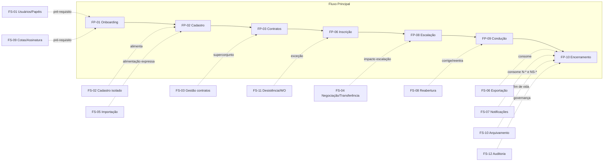

# Subtask 0.4.2 — Identificar fluxos secundários

**Sprint:** Fundação, escopo e contratos
**Task:** Mapear fluxos
**Status:** completed
**Timestamp:** 2026-06-28T23:03:19.305882

---

## Output do OpenCode (GLM 5.2)

Vou ler o relatório 0.4.1 (fluxo principal) e relatórios relacionados para manter a consistência.
Tenho contexto completo das subtasks anteriores. Vou verificar o runner.py para entender como o relatório deve ser escrito (sobrescreve ou preserva conteúdo).
Tenho contexto completo das 25 entidades (E-01 a E-25), 27 relacionamentos (R01 a R27), 10 invariantes (I-01 a I-10), 8 regras transversais, 26 não-objetivos, fluxo principal (FP-01 a FP-11, G-1 a G-4, N-1 a N-7) e o handoff explícito de 0.4.1 para 0.4.2. Vou gerar o documento técnico dos fluxos secundários e salvá-lo no arquivo.

Vou escrever em partes via heredocs (abordagem que funcionou em 0.4.1) para contornar limites de payload.
Agora vou validar a estrutura e integridade do conteúdo gerado.
O documento está completo e consistente. Validação final dos trechos de abertura e encerramento:
Subtask **0.4.2 — Identificar fluxos secundários** concluída e salva em `orchestrator/reports/sprint_0_subtask_0.4.2.md` (657 linhas).

**12 fluxos secundários identificados** (FS-01 a FS-12):
- **Gates:** 1 novo (G-5 — transferência) + 2 reutilizados do FP (G-1, G-3)
- **Notificações:** 7 adicionais (NS-1 a NS-7), totalizando 14 no MVP
- **Máquinas de estados:** 2 novas (Negociação, Proposta) + extensão do Contrato + lifecycle de Notificação e Assinatura
- **Cobertura combinada FP + FS:** 25/25 entidades, 10/10 invariantes, 8/8 regras transversais — I-08 e regra transversal 6 são **exclusivamente** exercitadas por FS-04 e FS-10
- **Handoff explícito** para 0.4.3 (pontos de falha) com 9 pendências detalhadas


## Stderr

```

> build · glm-5.2

$ ls -la orchestrator/reports/ 2>/dev/null && echo "---" && ls -la orchestrator/ 2>/dev/null
total 144
drwxrwxr-x 2 alex alex  4096 jun 28 22:47 .
drwxrwxr-x 6 alex alex  4096 jun 28 22:41 ..
-rw-rw-r-- 1 alex alex  1214 jun 28 21:42 sprint_0_subtask_0.1.2.md
-rw-rw-r-- 1 alex alex  2352 jun 28 21:51 sprint_0_subtask_0.1.3.md
-rw-rw-r-- 1 alex alex  6114 jun 28 22:04 sprint_0_subtask_0.2.2.md
-rw-rw-r-- 1 alex alex  6973 jun 28 22:09 sprint_0_subtask_0.2.3.md
-rw-rw-r-- 1 alex alex  5710 jun 28 22:20 sprint_0_subtask_0.3.1.md
-rw-rw-r-- 1 alex alex  4689 jun 28 22:23 sprint_0_subtask_0.3.2.md
-rw-rw-r-- 1 alex alex 19343 jun 28 22:41 sprint_0_subtask_0.3.3.md
-rw-rw-r-- 1 alex alex 75570 jun 28 22:49 sprint_0_subtask_0.4.1.md
---
total 72
drwxrwxr-x 6 alex alex  4096 jun 28 22:41 .
drwxrwxr-x 5 alex alex  4096 jun 28 21:24 ..
drwxrwxr-x 2 alex alex  4096 jun 28 21:22 prompts
drwxrwxr-x 2 alex alex  4096 jun 28 21:41 __pycache__
drwxrwxr-x 2 alex alex  4096 jun 28 22:47 reports
-rw------- 1 alex alex 16525 jun 28 22:41 runner.py
-rw------- 1 alex alex 23899 jun 28 22:49 sprints.json
drwxrwxr-x 2 alex alex  4096 jun 28 21:23 state
-rw------- 1 alex alex  2975 jun 28 21:40 whatsapp_notify.py

→ Read orchestrator/reports/sprint_0_subtask_0.4.1.md
→ Read orchestrator/reports/sprint_0_subtask_0.2.3.md
→ Read orchestrator/reports/sprint_0_subtask_0.3.3.md
→ Read orchestrator/reports/sprint_0_subtask_0.2.2.md
→ Read orchestrator/reports/sprint_0_subtask_0.3.1.md
→ Read orchestrator/reports/sprint_0_subtask_0.3.2.md
→ Read orchestrator/runner.py [offset=180, limit=60]
→ Read orchestrator/reports/sprint_0_subtask_0.4.1.md [offset=1, limit=35]

$ cat > /home/alex/saas-futebol/orchestrator/reports/sprint_0_subtask_0.4.2.md << 'PARTE1'
# Subtask 0.4.2 — Identificar fluxos secundários

**Sprint:** Fundação, escopo e contratos
**Task:** Mapear fluxos
**Status:** completed
**Época:** 2026-06-28
**Modelo:** opencode-go/glm-5.2

---

## Output do OpenCode (GLM 5.2)

Documento técnico que identifica e detalha os **fluxos secundários** do SaaS de futebol — todos os caminhos operacionais que não pertencem ao fluxo principal (ciclo de operação de uma edição de competição, mapeado em 0.4.1 como FP-01 a FP-11) — em conformidade com as 25 entidades (E-01 a E-25), os 27 relacionamentos (R01 a R27), os 10 invariantes (I-01 a I-10), as 8 regras transversais de 0.3.3, os 26 não-objetivos (N-01 a N-26) e as 7 implicações de desenho do MVP.

---

# Fluxos secundários — SaaS de Futebol

## 1. Sumário executivo

O fluxo principal (0.4.1) descreve o caminho único de maior valor: o ciclo de operação de uma edição de competição (FP-01 a FP-11), com 4 gates (G-1 a G-4) e 7 notificações (N-1 a N-7). Os **fluxos secundários** são todos os caminhos operacionais que existem independentemente do fluxo principal, que o alimentam, que o corrigem ou que administram a plataforma. Eles não são opcionais — são necessários para que o fluxo principal funcione e para que o tenant seja governável.

**Critério de classificação:** um fluxo é secundário (e não principal) quando atende a pelo menos um destes critérios:

1. **Pode ocorrer fora do contexto de uma edição de competição** (ex.: cadastro isolado, gestão de contratos, gestão de usuários).
2. **Trata exceção ou correção do fluxo principal** (ex.: reabertura de partida, desistência de clube, soft-delete).
3. **Administra a plataforma ou o tenant** (ex.: gestão de cotas, auditoria, notificações).
4. **Movimenta dados para dentro ou fora do sistema em lote** (ex.: importação/exportação).

**Conteúdo produzido:**

- **12 fluxos secundários** (FS-01 a FS-12)
- **1 gate de aprovação adicional** (G-5) + reutilização de G-3 (reabertura de partida)
- **7 notificações adicionais** (NS-1 a NS-7, namespace distinto das N-1 a N-7 do fluxo principal e dos N-01 a N-26 não-objetivos)
- **2 máquinas de estados adicionais** (Negociação, Proposta) + máquina de lifecycle da Notificação
- **Cobertura combinada FP + FS: 25/25 entidades** — FS-04 mobiliza E-16/E-17/E-18 (únicas entidades fora do happy path); FS-05/FS-06 mobilizam E-24 parcialmente; E-25 permanece reservada para Sprint 5
- **Invariantes:** FS-04 exercita **I-08** (única invariante não coberta pelo FP); FS-10 exercita **regra transversal 6** (soft-delete cascade, não coberta pelo FP); FS-08 exercita **regra transversal 8** (imutabilidade pós-24h) no sentido inverso (reabertura)
- **Conformidade total** com os 26 não-objetivos e as 7 implicações de desenho do MVP

**Convenção de nomeação:**

- Fluxos secundários: **FS-01 a FS-12**
- Gates adicionais: **G-5** (G-1 a G-4 definidos em 0.4.1; G-3 reutilizado em FS-08)
- Notificações adicionais: **NS-1 a NS-7** (NS = Notificação Secundária; distintas das N-1 a N-7 do fluxo principal e dos N-01 a N-26 não-objetivos)
PARTE1
echo "Parte 1 escrita"
Parte 1 escrita

$ cat >> /home/alex/saas-futebol/orchestrator/reports/sprint_0_subtask_0.4.2.md << 'PARTE2'

---

## 2. Catálogo de fluxos secundários

| ID | Nome | Critério | Ator principal | Entidades principais | Gate | Notificações |
|----|------|----------|-----------------|----------------------|------|--------------|
| FS-01 | Gestão de usuários e papéis | 1, 3 | `admin_tenant` | E-03, E-04 | — | NS-1 |
| FS-02 | Cadastro isolado de clubes, pessoas e equipes | 1 | `gestor_clube`, `admin_tenant` | E-05, E-06, E-09 | — | — |
| FS-03 | Gestão de contratos (criação, renovação, rescisão) | 1 | `gestor_clube` → `aprovador` | E-07, E-19, E-20, E-21 | G-1 | NS-2, NS-3 |
| FS-04 | Negociação e transferência de atletas | 1 | `gestor_clube` (vendedor/comprador) → `aprovador` | E-16, E-17, E-18, E-07 | G-5 | NS-4, NS-5 |
| FS-05 | Importação de dados em lote | 4 | `admin_tenant`, `gestor_clube` | E-05, E-06, E-07, E-24 | — | NS-6 |
| FS-06 | Exportação de dados e relatórios | 4 | `admin_tenant`, `gestor_clube`, `gestor_competicao` | (todas as de negócio) | — | — |
| FS-07 | Gestão de notificações (consumo e preferências) | 3 | Todos os usuários | E-22 | — | — |
| FS-08 | Reabertura de partida via G-3 | 2 | `gestor_competicao` → `aprovador` | E-13, E-14, E-19, E-20, E-21 | G-3 | NS-7 |
| FS-09 | Gestão de cotas e assinatura | 3 | `admin_tenant` | E-01, E-02 | — | NS-1 |
| FS-10 | Arquivamento e soft-delete de entidades | 2 | `admin_tenant`, `gestor_clube` | E-05, E-07, E-09 | — | NS-3 |
| FS-11 | Desistência/WO de clube em edição em andamento | 2 | `gestor_clube` → `gestor_competicao` | E-05, E-11, E-13 | — | NS-7 |
| FS-12 | Consulta de auditoria e trilha de logs | 3 | `auditor_somente_leitura`, `admin_tenant` | E-23 | — | — |

---

## 3. Detalhamento por fluxo secundário

Cada fluxo declara **gatilho**, **ator principal**, **entidades criadas/mutadas**, **pré-condições**, **pós-condições**, **etapas**, **máquina de estados** (quando aplicável), **gates**, **notificações**, **invariantes exercitados** e **interação com o fluxo principal**.

### FS-01 — Gestão de usuários e papéis (admin RBAC)

- **Gatilho:** `admin_tenant` precisa criar, suspender ou reatribuir papéis a usuários do tenant.
- **Ator:** `admin_tenant` (único papel que administra RBAC dentro do tenant; `admin_plataforma` atua só em incidentes cross-tenant).
- **Entidades:** E-03 (Usuário), E-04 (Papel), `rel_usuario_papel` (R03), E-23 (Auditoria).
- **Pré-condições:** tenant ativo; `admin_tenant` autenticado; cotas de usuários do plano não excedidas (R02, I-02).
- **Pós-condições:** usuário criado/suspensão/reatribuído; auditoria grava diff (R25/R26, I-09); RLS garante isolamento (I-01, I-10).
- **Etapas:**
  1. `admin_tenant` cria Usuário (e-mail, nome) ou convida por e-mail.
  2. Sistema atribui `tenant_id` da sessão (I-01, I-10) e define `status = 'ativo'`.
  3. `admin_tenant` atribui um ou mais Papéis (E-04) via `rel_usuario_papel` (R03).
  4. Sistema valida que Papel e Usuário pertencem ao mesmo tenant (regra transversal 5 de 0.3.3).
  5. Suspensão: `admin_tenant` define `usuario.status = 'suspenso'`; trigger inativa todas as ligações de papel (`valido_ate = now()`) — PE de R03.
  6. Reativação: `admin_tenant` reverte `status = 'ativo'`; ligações de papel devem ser reatribuídas manualmente.
- **Gate:** nenhum (RBAC é decisão administrativa do `admin_tenant`, não exige aprovação).
- **Notificações:** **NS-1** (convite de usuário ou reatribuição de papel) ao usuário afetado.
- **Invariantes exercitados:** I-01 (tenant único), I-02 (cotas), I-09 (auditoria), I-10 (tenant_id cascata).
- **Interação com FP:** FS-01 é pré-requisito de FP-01 (onboarding cria o primeiro `admin_tenant`) e de todas as etapas (todo ator do FP precisa de papel válido). Pode ocorrer a qualquer momento do ciclo de vida do tenant.

### FS-02 — Cadastro isolado de clubes, pessoas e equipes

- **Gatilho:** `gestor_clube` ou `admin_tenant` cadastra clube, pessoa ou equipe fora do contexto de uma edição de competição (ex.: na fase de implantação do tenant, antes de qualquer competição).
- **Ator:** `gestor_clube` (cadastro de clubes/pessoas em seu escopo) ou `admin_tenant` (cadastro inicial ou correção).
- **Entidades:** E-05 (Clube), E-06 (Pessoa com `tipo` em {atleta, staff}), E-09 (Equipe/Categoria), `rel_equipe_atleta` (R09), E-23 (Auditoria).
- **Pré-condições:** tenant ativo; cotas do plano não excedidas (R02, I-02); `gestor_clube` só opera clubes sob seu escopo.
- **Pós-condições:** Clube em `status = 'ativo'`; Equipes criadas com `(categoria, genero)` UNIQUE dentro do Clube (R08); Pessoas elegíveis para futura vinculação contratual; auditoria grava diff (I-09).
- **Etapas:**
  1. Cadastro de Clube: nome, cores, escudo (upload opcional), `status = 'ativo'`. Validação de cota (I-02).
  2. Cadastro de Pessoa: nome, data_nascimento, `tipo` em {atleta, staff}, documento (opcional no MVP). Pessoa existe no tenant mas sem vínculo ativo.
  3. Criação de Equipe: vinculada a Clube; `categoria` (ex.: Profissional, Sub-20) + `genero` UNIQUE por Clube (R08, I-07 análogo).
  4. Vinculação de atleta à equipe (opcional): exige contrato ativo prévio (regra transversal 2 de 0.3.3); cria linha em `rel_equipe_atleta` (R09).
- **Gate:** nenhum (cadastro fundacional não exige aprovação; o gate G-1 aparece quando o vínculo se formaliza via Contrato em FS-03/FP-03).
- **Notificações:** nenhuma (cadastro isolado é operação silenciosa; notificações disparam quando há aprovação ou mudança de estado de entidade compartilhada).
- **Invariantes exercitados:** I-02 (cotas), I-04 (vínculo atleta/equipe único por período), I-09 (auditoria), I-10 (tenant_id).
- **Interação com FP:** FS-02 é superconjunto de FP-02 (cadastro no contexto do fluxo principal). Quando executado isoladamente, prepara o tenant para futuras edições. FP-02 reutiliza as mesmas entidades e regras, apenas no contexto temporal de uma competição.

### FS-03 — Gestão de contratos (criação, renovação, rescisão)

- **Gatilho:** `gestor_clube` precisa criar, renovar ou rescindir o contrato de uma Pessoa com o Clube, independentemente de haver competição em andamento.
- **Ator:** `gestor_clube` (proponente) → `aprovador` (gate G-1 para criação/renovação); `gestor_clube` + `admin_tenant` (rescisão, com gate opcional).
- **Entidades:** E-07 (Contrato), E-19 (Fluxo de aprovação), E-20 (Solicitação `tipo_ref = 'contrato'`), E-21 (Aprovação), E-22 (Notificação), E-23 (Auditoria).
- **Pré-condições:** Pessoa e Clube pré-existentes (via FS-02); Pessoa sem contrato ativo no mesmo Clube (R04/R05/R06, I-03); `data_inicio <= hoje`.
- **Pós-condições:** `contrato.status` na máquina de estados (criação ativa, renovação substitui, rescisão libera pessoa); auditoria grava diff (I-09); notificações disparadas.
- **Etapas:**
  1. **Criação:** `gestor_clube` propõe contrato (Pessoa, Clube, datas, cláusulas). Cria Solicitação (E-20) `tipo_ref = 'contrato'`.
  2. **Gate G-1:** `aprovador` defer/rejeita. Deferimento ativa contrato atomicamente (regra transversal 4 de 0.3.3). Rejeição: `contrato.status = 'rejeitado'`, Solicitação arquivada, NS-2 ao proponente.
  3. **Renovação:** `gestor_clube` cria novo contrato com `data_inicio = data_fim do contrato anterior + 1d`. Sistema valida que não há gap nem sobreposição (I-03). Novo gate G-1.
  4. **Rescisão:** `gestor_clube` ou `admin_tenant` move `contrato.status = 'rescindido'`. Trigger encerra todos os `rel_equipe_atleta` ativos (PE de R09). Dispara NS-3 (notificação de rescisão) ao `gestor_clube` e ao setor jurídico (se configurado).
  5. **Encerramento natural:** contrato atinge `data_fim`. Job diário move `status = 'expirado'`. Dispara NS-3.
- **Gate:** **G-1** (compartilhado com FP-03 do fluxo principal — mesmo mecanismo E-19/E-20/E-21).
- **Notificações:** **NS-2** (contrato rejeitado em G-1, ao proponente); **NS-3** (rescisão ou expiração, ao `gestor_clube` e jurídico).
- **Invariantes exercitados:** I-03 (no máximo um contrato ativo Pessoa/Clube), I-09 (auditoria), I-10 (tenant_id); regra transversal 4 (approval mirror).
- **Interação com FP:** FS-03 é superconjunto de FP-03. No fluxo principal, a criação de contrato ocorre como etapa FP-03; FS-03 cobre os caminhos de renovação e rescisão que não aparecem no happy path. Rescisão durante uma edição ativa pode invalidar escalações (PE de R09 → impacto em FP-08).
PARTE2
echo "Parte 2 escrita"
Parte 2 escrita

$ cat >> /home/alex/saas-futebol/orchestrator/reports/sprint_0_subtask_0.4.2.md << 'PARTE3'

### FS-04 — Negociação e transferência de atletas

- **Gatilho:** `gestor_clube` (clube vendedor) deseja negociar a transferência/emprestimo de um atleta contratado para outro clube (comprador).
- **Ator:** `gestor_clube` vendedor (abre negociação) + `gestor_clube` comprador (envia proposta) → `aprovador` (gate G-5 para transferência).
- **Entidades:** E-16 (Negociação/Transferência), E-17 (Proposta), E-18 (Anexo/Evidência), E-07 (Contrato de origem e novo contrato de destino), E-19/E-20/E-21 (fluxo de aprovação), E-22 (Notificação), E-23 (Auditoria).
- **Pré-condições:** Contrato de origem ativo (R18); Clube vendedor é parte ativa do contrato; Clube comprador é `ativo` e distinto do vendedor (R07, `clube_origem_id <> clube_destino_id`); Pessoa (atleta) com `tipo = 'atleta'`.
- **Pós-condições:** Proposta aceita gera novo Contrato de destino (via G-5); Contrato de origem move-se para `rescindido` ou `emprestado` conforme `tipo_negociacao`; auditoria grava diff (I-09); `rel_equipe_atleta` do clube vendedor é encerrada (PE de R09).
- **Etapas:**
  1. `gestor_clube` vendedor cria Negociação (E-16) com `contrato_origem_id` (R18, UNIQUE 1:1), `tipo_negociacao` em {transferencia_definitiva, emprestimo}, `status = 'aberta'`.
  2. `gestor_clube` comprador envia Proposta (E-17) com valores esportivos (não contábeis — alinhado a N-18 a N-20) e condições.
  3. Anexos (E-18) opcionais na proposta; Proposta `aceita` exige ≥1 evidência documental (R20, check em trigger).
  4. Vendedor avalia propostas; pode haver múltiplas propostas (R19, 1:N) mas **apenas uma** pode estar `aceita` por negociação (I-08, constraint parcial `UNIQUE (negociacao_id) WHERE status = 'aceita'`).
  5. Proposta aceita → cria Solicitação (E-20) `tipo_ref = 'transferencia'` para gate G-5.
  6. **Gate G-5:** `aprovador` defer/rejeita a transferência. Deferimento ativa atomicamente: (a) cria novo Contrato de destino (E-07) com `status = 'ativo'`; (b) move Contrato de origem para `rescindido` (transferência definitiva) ou mantém ativo com cláusula de empréstimo via `rel_contrato_clube` (R07, empréstimo); (c) encerra `rel_equipe_atleta` no clube vendedor (PE de R09).
  7. Rejeição em G-5: Proposta permanece `aceita` mas Negociação volta para `aberta`; NS-5 ao comprador e vendedor com motivo.
- **Gate:** **G-5** — aprovação de transferência/emprestimo. `tipo_ref = 'transferencia'`. Mecanismo genérico E-19/E-20/E-21 (aprovações como dados). Respeita ordem de etapa (R21/R22) e atomicidade do efeito colateral (regra transversal 4 de 0.3.3).
- **Notificações:** **NS-4** (proposta recebida, ao vendedor); **NS-5** (transferência deferida/rejeitada em G-5, a comprador e vendedor).
- **Invariantes exercitados:** **I-08** (apenas uma proposta aceita por negociação — única invariante não exercitada no fluxo principal), I-03 (novo contrato ativo Pessoa/Clube no destino), I-09 (auditoria), I-10 (tenant_id); regras transversais 4 (approval mirror) e 5 (tenant boundary).
- **Interação com FP:** FS-04 ocorre fora do contexto de uma edição (critério 1). Se a transferência ocorrer durante uma edição em andamento, o atleta pode ser removido de escalações futuras (PE de R09 → impacto em FP-08). A Novo contrato de destino habilita o atleta para escalação no novo clube (FP-04/F-08). Esta é a **única via de movimentação de atletas entre clubes** no MVP — não há mercado livre não supervisionado.

### FS-05 — Importação de dados em lote

- **Gatilho:** `admin_tenant` ou `gestor_clube` precisa popular o sistema a partir de dados legados (planilhas, exports de sistemas anteriores).
- **Ator:** `admin_tenant` (importação de qualquer entidade) ou `gestor_clube` (importação restrita a clubes/pessoas sob seu escopo).
- **Entidades:** E-05 (Clube), E-06 (Pessoa), E-07 (Contrato), E-09 (Equipe), E-24 (Log de integração — registrado mesmo para importação interna), E-23 (Auditoria).
- **Pré-condições:** tenant ativo; cotas não excedidas (validação por linha, não por arquivo — I-02); arquivo no formato aceito (task 2.4.1: CSV e XLSX no MVP).
- **Pós-condições:** dados válidos persistidos; dados inválidos rejeitados com relatório de falhas (task 2.4.4); auditoria grava diff para cada linha inserida (I-09); log de integração grava `correlation_id`, `latencia_ms`, número de linhas processadas/aceitas/rejeitadas (R27 análogo).
- **Etapas:**
  1. Usuário faz upload do arquivo (CSV/XLSX, ≤ 10MB, ≤ 5000 linhas por lote no MVP).
  2. Sistema valida formato e estrutura (task 2.4.2): cabeçalho esperado, tipos de coluna, encoding (UTF-8).
  3. Sistema percorre linhas em modo transacional por batch (100 linhas por transação):
     a. **Validação semântica** por linha: PK duplicada, FK inexistente, violação de UNIQUE, cota excedida.
     b. **Conflito de dados** (task 2.4.3): se linha refere-se a entidade existente (match por CPF/nome+data), política padrão é `pular` (não sobrescrever); usuário pode optar por `sobrescrever` (exige confirmação explícita no upload).
     c. Linhas válidas: INSERT com `tenant_id` da sessão (I-10); auditoria grava diff (I-09).
     d. Linhas inválidas: coletadas para relatório de falhas (task 2.4.4) com linha, campo, motivo.
  4. Sistema consolida resultado: `N_linhas_total`, `N_aceitas`, `N_rejeitadas`, `tempo_total_ms`.
  5. Log de integração (E-24) grava o resultado do lote (não por linha — granularidade de arquivo).
  6. Notificação NS-6 enviada ao usuário com resumo e link para relatório de falhas (se houver).
- **Gate:** nenhum (importação é operação administrativa; a aprovação eventualemente necessária para contratos importados ocorre em G-1 quando os contratos são formalizados individualmente — a importação cria Contratos em `status = 'rascunho'`, não `ativo`).
- **Notificações:** **NS-6** (importação concluída — sucesso total ou parcial, com link para relatório de falhas).
- **Invariantes exercitados:** I-02 (cotas validadas por linha), I-03 (contrato ativo único Pessoa/Clube — importação que viole é rejeitada na linha), I-09 (auditoria), I-10 (tenant_id em cada INSERT); regra transversal 7 (idempotência — `correlation_id` do lote impede reprocessamento duplicado).
- **Interação com FP:** FS-05 é via expressa de preparação do tenant antes do fluxo principal (FP-02). Pode ocorrer a qualquer momento. Contratos importados em `rascunho` devem passar por G-1 (FS-03/FP-03) para serem ativados. Esta é a **única via de migração de dados legados** no MVP (não-objetivo N-19 exclui scripts de migração automáticos).

### FS-06 — Exportação de dados e relatórios

- **Gatilho:** Usuário precisa exportar listagens, relatórios ou dados de partidas para uso externo (auditoria, arquivo, compartilhamento).
- **Ator:** `admin_tenant` (qualquer dado do tenant), `gestor_clube` (dados de seu escopo), `gestor_competicao` (dados de competições sob seu escopo), `auditor_somente_leitura` (exportação somente leitura).
- **Entidades:** Consulta sobre qualquer entidade de negócio; E-24 (Log de integração — registra exportação); E-23 (Auditoria — registra o ato de exportar).
- **Pré-condições:** usuário autenticado com papel válido; RLS garante que só exporta dados de seu escopo (I-01, I-10).
- **Pós-condições:** arquivo gerado no formato solicitado (task 2.4.1: CSV, XLSX, PDF no MVP); log de integração grava exportação; auditoria registra quem exportou o quê.
- **Etapas:**
  1. Usuário seleciona conjunto de dados (ex.: elenco de um clube, classificação de uma edição, boletim de uma partida, relatório semanal).
  2. Sistema aplica RLS para filtrar dados visíveis ao papel do usuário (I-01).
  3. Sistema gera arquivo no formato solicitado (síncrono para ≤ 1000 linhas; assíncrono com NS-6 para > 1000 linhas).
  4. Log de integração (E-24) grava: `tipo_operacao = 'exportacao'`, `entidade_tipo`, `N_linhas`, `formato`, `correlation_id`.
  5. Auditoria (E-23) grava: ator, entidade_tipo, parâmetros da exportação (não o conteúdo — conteúdo pode ser grande; o log registra metadados).
  6. Arquivo disponibilizado para download (link temporário, válido por 24h).
- **Gate:** nenhum (exportação é operação de leitura; não altera estado).
- **Notificações:** **NS-6** (apenas para exportações assíncronas — link pronto para download).
- **Invariantes exercitados:** I-01 (RLS), I-09 (auditoria do ato), I-10 (tenant boundary); regra transversal 7 (idempotência — `correlation_id` único por exportação).
- **Interação com FP:** FS-06 consome dados produzidos pelo fluxo principal (FP-10/FP-11). É a via de saída de dados para prestação de contas, auditoria externa e arquivamento. Não invoca BI self-service (não-objetivo N-25 → futuro F-10) nem API pública (não-objetivo N-26 → futuro F-03).
PARTE3
echo "Parte 3 escrita"
Parte 3 escrita

$ cat >> /home/alex/saas-futebol/orchestrator/reports/sprint_0_subtask_0.4.2.md << 'PARTE4'

### FS-07 — Gestão de notificações (consumo e preferências)

- **Gatilho:** Usuário acessa sua central de notificações para visualizar, marcar lidas, arquivar ou configurar preferências de canal.
- **Ator:** Todos os usuários (cada um gerencia suas próprias notificações); `admin_tenant` pode configurar preferências globais do tenant (canal padrão, periodicidade de resumo).
- **Entidades:** E-22 (Notificação), `rel_notificacao_usuario` (R24), E-03 (Usuário), E-23 (Auditoria — para mudança de preferências).
- **Pré-condições:** usuário autenticado; notificações existem no tenant (criadas por triggers do FP ou FS).
- **Pós-condições:** estado por usuário (`lida_em`, `arquivada`) atualizado em `rel_notificacao_usuario` (R24); preferências persistidas; notificações expiradas podadas por job.
- **Etapas:**
  1. Usuário abre central de notificações (lista paginada, ordenada por `criada_em DESC`).
  2. Sistema lista notificações via `rel_notificacao_usuario` filtrado por `usuario_id` + `tenant_id` (RLS, I-01).
  3. Usuário marca notificação como lida: `rel_notificacao_usuario.lida_em = now()`.
  4. Usuário arquiva notificação: `rel_notificacao_usuario.arquivada = true`.
  5. Usuário acessa preferências: escolhe canal (in-app, e-mail — únicos canais no MVP; push/SMS são não-objetivos N-09/N-11) e periodicidade de resumo (diária, semanal, nunca).
  6. Job diário poda notificações com `validade_ate < now()` (PE de R24) — remove `rel_notificacao_usuario` mas preserva Notificação pai para auditoria (RESTRICT em Notificação, CASCADE em junção — R24).
  7. Job de resumo (diário/semanal conforme preferência): agrega notificações não lidas e envia e-mail consolidado.
- **Gate:** nenhum.
- **Notificações:** nenhuma (FS-07 é o próprio fluxo de consumo de notificações; não dispara novas notificações, apenas gerencia as existentes).
- **Invariantes exercitados:** I-01 (RLS — usuário só vê suas notificações), I-09 (auditoria para mudança de preferências administrativas), I-10 (tenant_id).
- **Interação com FP:** FS-07 é o ponto de consumo de todas as notificações N-1 a N-7 (FP) e NS-1 a NS-7 (FS). Sem FS-07, as notificações disparadas pelos fluxos não teriam destino operacional. O canal padrão (in-app + e-mail) é alinhado com a implicação de desenho do MVP "motor de notificações abstraído" (0.2.3, Seção 6).

### FS-08 — Reabertura de partida via G-3

- **Gatilho:** `gestor_competicao` identifica erro em partida concluída (ex.: placar incorreto, evento mal registrado) e precisa reabrir para correção.
- **Ator:** `gestor_competicao` (solicita) → `aprovador` (gate G-3).
- **Entidades:** E-13 (Partida), E-14 (Evento de partida — descartados na reabertura), E-15 (Escalação — descongelada), E-19/E-20/E-21 (fluxo de aprovação), E-22 (Notificação), E-23 (Auditoria).
- **Pré-condições:** Partida em `status = 'concluida'`; **imutabilidade pós-24h** (regra transversal 8 de 0.3.3): se a partida foi concluída há mais de 24h, a reabertura **exige** G-3; se há menos de 24h, `gestor_competicao` pode reabrir diretamente (janela de correção livre).
- **Pós-condições:** `partida.status = 'rascunho'`; eventos (E-14) descartados via CASCADE (R15 OS); escalação (E-15) descongelada mas preservada (reutilizável); classificação da Edição recálculada retroativamente (PE de R11); auditoria grava diff da reabertura (I-09); notificação NS-7 aos envolvidos.
- **Etapas:**
  1. `gestor_competicao` solicita reabertura da Partida.
  2. Sistema verifica tempo desde `concluida_em`:
     a. **< 24h:** reabertura direta (sem gate). `partida.status = 'rascunho'`, eventos descartados.
     b. **≥ 24h:** cria Solicitação (E-20) `tipo_ref = 'partida_reabertura'` para gate G-3.
  3. **Gate G-3** (apenas se ≥ 24h): `aprovador` defer/rejeita.
     a. **Deferido:** `partida.status = 'rascunho'`; eventos descartados (R15 OS CASCADE); escalação preservada.
     b. **Rejeitado:** Partida permanece `concluida`; auditoria registra tentativa de reabertura com motivo.
  4. Após reabertura (direta ou via G-3), `gestor_competicao` ou `delegado_partida` regrava eventos corretos (volta para FP-09).
  5. Partida reencaminha-se por FP-09 → FP-10; classificação recalculada (PE de R11).
- **Gate:** **G-3** (compartilhado com FP-10 do fluxo principal — mesmo mecanismo, `tipo_ref = 'partida_reabertura'`). G-3 só é exigido quando > 24h; < 24h é reabertura livre.
- **Notificações:** **NS-7** (reabertura deferida, aos `gestor_clube` envolvidos, `delegado_partida` e `gestor_competicao` — sinaliza que placar/events podem mudar e classificação será recalculada).
- **Invariantes exercitados:** I-09 (auditoria da reabertura e do motivo), I-10 (tenant_id); **regra transversal 8** (imutabilidade pós-24h — exercitada no sentido inverso: o fluxo que **quebra** a imutabilidade de forma controlada).
- **Interação com FP:** FS-08 é o fluxo de exceção que corrige FP-09/FP-10. Após reabertura, a Partida reentra no fluxo principal em FP-09 (condução). É o **único caminho legítimo** para alterar partida concluída — qualquer mutação direta fora deste fluxo é proibida pela regra transversal 8 e deve ser bloqueada por trigger.

### FS-09 — Gestão de cotas e assinatura

- **Gatilho:** `admin_tenant` precisa consultar cotas, fazer upgrade/downgrade de plano ou verificar status da assinatura.
- **Ator:** `admin_tenant` (único papel que gerencia assinatura); `admin_plataforma` (intervenção cross-tenant em incidentes — fora do MVP normal).
- **Entidades:** E-01 (Organização), E-02 (Assinatura), E-22 (Notificação), E-23 (Auditoria).
- **Pré-condições:** tenant ativo; assinatura ativa (I-02, constraint parcial UNIQUE).
- **Pós-condições:** plano atualizado (ou rejeitado se downgrade violar cotas em uso); cotas recalculadas; auditoria grava diff (I-09); notificação NS-1 ao `admin_tenant`.
- **Etapas:**
  1. `admin_tenant` consulta dashboard de cotas: `N_clubes`, `N_pessoas`, `N_usuarios`, `N_competicoes_ativas` vs. limites do plano.
  2. **Upgrade:** `admin_tenant` seleciona plano superior. Sistema atualiza `assinatura.plano_id` e recalcula cotas (PE de R02). Upgrade é imediato (não há gate — é decisão comercial do tenant).
  3. **Downgrade:** `admin_tenant` seleciona plano inferior. Sistema valida se cotas em uso cabem no novo plano (R02, IRC):
     a. Se couber: downgrade imediato.
     b. Se não couber: downgrade **rejeitado** com listagem de entidades excedentes (ex.: "Você tem 15 clubes; o plano Basic permite 10"). `admin_tenant` deve arquivar/inativar entidades (FS-10) antes de fazer downgrade.
  4. Suspensão por inadimplência: job externo (gateway de pagamento) notifica sistema; sistema move `assinatura.status = 'suspensa'`; `organizacao.status = 'suspenso'`; novas sessões bloqueadas (PE de R01). Dados preservados para auditoria.
  5. Reativação: pagamento confirmado → `assinatura.status = 'ativa'`, `organizacao.status = 'ativa'`.
- **Gate:** nenhum (gestão de assinatura é decisão administrativa/comercial; não há aprovação interna).
- **Notificações:** **NS-1** (mudança de plano confirmada, ao `admin_tenant`); NS-1 também para alerta de cota próxima do limite (> 90% de qualquer cota — job diário verifica).
- **Invariantes exercitados:** I-02 (uma assinatura ativa por tenant, constraint parcial UNIQUE), I-09 (auditoria), I-10 (tenant_id).
- **Interação com FP:** FS-09 governa as cotas que limitam FP-01 (onboarding), FP-02 (cadastro de clubes/pessoas) e FP-05 (criação de competições). Suspensão da assinatura bloqueia todo o fluxo principal. É pré-requisito administrativo de todo o FP.

### FS-10 — Arquivamento e soft-delete de entidades

- **Gatilho:** `admin_tenant` ou `gestor_clube` precisa arquivar/inativar um Clube, Equipe ou Pessoa que não será mais usado, sem perder histórico.
- **Ator:** `admin_tenant` (qualquer entidade) ou `gestor_clube` (clubes/pessoas sob seu escopo).
- **Entidades:** E-05 (Clube), E-07 (Contrato), E-09 (Equipe), `rel_equipe_atleta` (R09), E-22 (Notificação), E-23 (Auditoria).
- **Pré-condições:** entidade existe e está `ativa`; **não há partidas associadas em edição em andamento** (validação: se Clube tem `rel_edicao_clube` ativa em Edição não `concluida`, arquivamento é bloqueado — deve-se primeiro desistir via FS-11); `admin_tenant` ou `gestor_clube` autenticado.
- **Pós-condições:** Clube em `status = 'arquivado'`; Equipes indisponíveis para novas competições (PE de R08); Contratos ativos movidos para `suspenso_clube` (regra transversal 6 de 0.3.3); `rel_equipe_atleta` encerrado (PE de R09); **Partidas históricas preservadas** (regra transversal 6: "nunca exclui Partidas históricas"); auditoria grava diff (I-09).
- **Etapas:**
  1. Usuário solicita arquivamento de Clube.
  2. Sistema valida: Clube não tem inscrição ativa em edição em andamento (senão → FS-11 primeiro).
  3. Sistema executa **soft-delete cascade** (regra transversal 6 de 0.3.3):
     a. `clube.status = 'arquivado'`.
     b. Todas as Equipes do Clube: `status = 'arquivada'` (PE de R08).
     c. Todos os Contratos ativos do Clube: `status = 'suspenso_clube'` (não `rescindido` — preserva direito de reativação).
     d. Todos os `rel_equipe_atleta` ativos: `dt_fim = now()` (PE de R09).
     e. **Partidas históricas**: **NENHUMA mutação** — placar, eventos, escalação, classificação permanecem imutáveis (regra transversal 6 explícita).
  4. Auditoria grava diff de cada entidade mutada (I-09).
  5. Notificação NS-3 ao `gestor_clube` afetado e `admin_tenant`.
  6. **Reativação** (reversão): `admin_tenant` reverte `clube.status = 'ativo'`; Contratos em `suspenso_clube` voltam a `ativo` (se `data_fim` não expirou); Equipes reativadas; `rel_equipe_atleta` deve ser recriado manualmente (não auto-restaurado — segurança).
- **Gate:** nenhum (soft-delete é operação administrativa; o gate G-2 de inscrição em edição cuida da proteção competitiva).
- **Notificações:** **NS-3** (arquivamento de clube, ao `gestor_clube` e `admin_tenant`).
- **Invariantes exercitados:** I-09 (auditoria), I-10 (tenant_id); **regra transversal 6** (soft-delete cascade — única regra transversal não exercitada no fluxo principal, exercitada aqui no sentido de preservação de histórico).
- **Interação com FP:** FS-10 é o fluxo de fim de vida de entidades que participaram do FP. Arquivamento de Clube durante uma edição ativa é bloqueado (deve-se usar FS-11 primeiro). Após arquivamento, o Clube não pode se inscrever em novas edições (FP-06 bloqueado por PE de R08). Partidas históricas permanecem imutáveis — preserva a integridade do FP passado.
PARTE4
echo "Parte 4 escrita"
Parte 4 escrita

$ cat >> /home/alex/saas-futebol/orchestrator/reports/sprint_0_subtask_0.4.2.md << 'PARTE5'

### FS-11 — Desistência/WO de clube em edição em andamento

- **Gatilho:** `gestor_clube` comunica que seu Clube não continuará na edição (desistência); ou `gestor_competicao` aplica WO por incomparecimento.
- **Ator:** `gestor_clube` (solicita desistência) → `gestor_competicao` (confirma e processa consequências).
- **Entidades:** E-05 (Clube), E-11 (Edição), E-13 (Partida), `rel_edicao_clube` (R12), E-22 (Notificação), E-23 (Auditoria).
- **Pré-condições:** Clube inscrito na Edição (`rel_edicao_clube.dt_saida IS NULL`); Edição em `status` em {`publicada`, `em_andamento`}; Partidas futuras do Clube existem.
- **Pós-condições:** `rel_edicao_clube.dt_saida = now()`; Partidas futuras do Clube marcadas como `WO` (placar 3-0 ou configuração por Regra de Competição — parâmetro a ser detalhado em 2.2.4); Partidas já disputadas pelo Clube **preservadas** (não retroativas); classificação recalculada (PE de R12); notificação NS-7 aos envolvidos.
- **Etapas:**
  1. `gestor_clube` solicita desistência via interface (seleciona Edição, informa motivo).
  2. `gestor_competicao` revisa e confirma desistência (ou rejeita se considerar imprópria — exige justificativa).
  3. Sistema processa WO (PE de R12):
     a. `rel_edicao_clube.dt_saida = now()`.
     b. Partidas futuras (Partida `status = 'agendada'` e Clube é mandante ou visitante): `status = 'wo'`, placar configurado (padrão 3-0 a favor do adversário, configurável por Regra de Competição — pendência de 2.2.4).
     c. Partidas já `concluidas`: **NENHUMA mutação** (preserva histórico — regra transversal 6 análoga).
     d. Partidas `em_andamento`: mantém estado atual (não interrompe partida em curso — pendência de 0.4.3).
  4. Classificação recalculada: partidas em WO contam pontos para o adversário; partidas já jogadas mantêm resultado (PE de R12).
  5. Auditoria grava diff (I-09).
  6. Notificação NS-7 a `gestor_clube` do desistente, `gestor_clube` dos adversários afetados e `gestor_competicao`.
- **Gate:** nenhum gate formal (desistência é confirmação bilateral `gestor_clube` + `gestor_competicao`, não aprovação via E-19/E-20/E-21). Se houver disputa sobre a desistência, `gestor_competicao` pode abrir Solicitação `tipo_ref = 'desistencia_edicao'` para G-2 (reutilização do gate de inscrição no sentido inverso) — detalhar em 3.3.4 (rejeição e retorno).
- **Notificações:** **NS-7** (desistência/WO processado, a todos os `gestor_clube` afetados e `gestor_competicao`).
- **Invariantes exercitados:** I-05 (mandante ≠ visitante — validado mesmo em WO, placar atribuído ao adversário), I-09 (auditoria), I-10 (tenant_id).
- **Interação com FP:** FS-11 é o fluxo de exceção que corrige FP-06 (inscrição) durante uma edição ativa. Partidas em WO não passam por FP-08/F-09 (não há escalação nem condução). O WO afeta FP-10 (consolidação) pois altera a classificação. Pendência: política de WO retroativo se o Clube desistir após já ter jogado (detalhar em 0.4.3 e 2.2.4).

### FS-12 — Consulta de auditoria e trilha de logs

- **Gatilho:** `auditor_somente_leitura` ou `admin_tenant` precisa consultar a trilha de mutações de uma entidade, um período ou um ator.
- **Ator:** `auditor_somente_leitura` (consulta tudo, altera nada), `admin_tenant` (consulta tudo + pode exportar via FS-06).
- **Entidades:** E-23 (Auditoria/Log), E-03 (Usuário — como ator), E-24 (Log de integração — se auditoria de integrações).
- **Pré-condições:** usuário autenticado com papel de auditoria ou admin; RLS garante isolamento por tenant (I-01, I-09).
- **Pós-condições:** nenhuma mutação (auditoria é **append-only** e **somente leitura** — I-09, RBAC + trigger BEFORE DELETE/UPDATE).
- **Etapas:**
  1. Usuário acessa dashboard de auditoria.
  2. Filtros: `entidade_tipo` (ex.: Clube, Contrato, Partida), `entidade_id`, `ator_id`, período (`criada_em` entre datas).
  3. Sistema retorna lista paginada (task 2.3.4) de registros de auditoria, ordenada por `criada_em DESC`.
  4. Cada registro exibe: `ator` (nome + papel), `entidade_tipo` + `entidade_id`, `operacao` (INSERT/UPDATE/DELETE), `diff` (JSONB — antes/depois), `criada_em`.
  5. Para auditoria de integrações: consulta E-24 (Log de integração) com filtros por `sistema_externo_id`, `http_status`, período, `correlation_id`.
  6. Usuário pode exportar resultado via FS-06 (CSV/XLSX/PDF).
  7. **Tentativa de mutação** (UPDATE/DELETE) na tabela de auditoria: bloqueada por trigger BEFORE + RBAC (I-09). Tentativa é registrada como evento de segurança (meta-auditoria).
- **Gate:** nenhum (consulta é somente leitura).
- **Notificações:** nenhuma.
- **Invariantes exercitados:** I-01 (RLS — auditor só vê logs do próprio tenant), I-09 (auditoria append-only — exercitada no sentido de **verificação da imutabilidade**), I-10 (tenant_id nos logs).
- **Interação com FP:** FS-12 é o fluxo de governança que verifica conformidade de todas as mutações do FP (FP-01 a FP-11) e dos FS (FS-01 a FS-11). Não altera estado — apenas observa. É pré-requisito para a task 6.2 (Auditoria) da Sprint 6.

---

## 4. Máquinas de estados adicionais

O fluxo principal (0.4.1) definiu 3 máquinas encadeadas (Edição, Fase, Partida) + máquina de suporte do Contrato. Os fluxos secundários introduzem **2 máquinas adicionais** e **1 máquina de lifecycle**.

### 4.1 Máquina da Negociação (E-16)

```
aberta --(FS-04 proposta aceita)--> em_aprovacao
em_aprovacao --(G-5 deferido)--> concluida
em_aprovacao --(G-5 rejeitado)--> aberta
aberta --(vendedor cancela)--> cancelada
concluida --(irreversível)--> [estado terminal]
cancelada --(irreversível)--> [estado terminal]
```

### 4.2 Máquina da Proposta (E-17)

```
enviada --(vendedor aceita)--> aceita
aceita --(G-5 deferido)--> executada
aceita --(G-5 rejeitado)--> enviada
enviada --(vendedor rejeita)--> recusada
recusada --(irreversível)--> [estado terminal]
executada --(irreversível)--> [estado terminal]
```

### 4.3 Máquina do Contrato (E-07) — extensão da máquina de 0.4.1

A máquina definida em 0.4.1 cobria `rascunho → ativo → rescindido`. Os fluxos secundários adicionam estados:

```
rascunho --(G-1 deferido)--> ativo
ativo --(FS-03 rescisão)--> rescindido
ativo --(FS-03 expiração)--> expirado
ativo --(FS-10 arquivamento do clube)--> suspenso_clube
suspenso_clube --(FS-10 reativação do clube)--> ativo
suspenso_clube --(FS-10 arquivamento permanente)--> rescindido
rascunho --(G-1 rejeitado)--> rejeitado
rejeitado --(irreversível)--> [estado terminal]
```

### 4.4 Máquina de lifecycle da Notificação (E-22)

A Notificação em si é imutável após criação; o estado por usuário vive em `rel_notificacao_usuario` (R24):

```
[criada] --(trigger de negócio)--> nao_lida
nao_lida --(FS-07 usuário marca lida)--> lida
lida --(FS-07 usuário arquiva)--> arquivada
nao_lida --(job poda validade_ate < now())--> expirada
lida --(job poda)--> expirada
arquivada --(job poda)--> expirada
```

> A Notificação pai (E-22) é preservada mesmo após expiração da junção (R24: RESTRICT na Notificação, CASCADE na junção). Isso garante que a trilha de comunicações existe para auditoria (FS-12).

### 4.5 Máquina da Assinatura (E-02) — lifecycle administrativo

```
ativa --(FS-09 upgrade/downgrade)--> ativa [muda plano_id]
ativa --(inadimplência)--> suspensa
suspensa --(pagamento)--> ativa
suspensa --(período carência > 90 dias)--> expirada
expirada --(irreversível)--> [estado terminal; dados preservados para auditoria]
```
PARTE5
echo "Parte 5 escrita"
Parte 5 escrita

$ cat >> /home/alex/saas-futebol/orchestrator/reports/sprint_0_subtask_0.4.2.md << 'PARTE6'

---

## 5. Gates de aprovação adicionais e reutilizados

O fluxo principal (0.4.1) definiu 4 gates (G-1 a G-4) via mecanismo genérico E-19/E-20/E-21. Os fluxos secundários adicionam **1 gate novo** e **reutilizam 1 gate existente**.

| Gate | Fluxo | `tipo_ref` | Efeito do deferimento | Rejeição |
|------|-------|-----------|------------------------|----------|
| **G-1** (reutilizado) | FS-03 | `contrato` | `contrato.status = 'ativo'` (criação/renovação) | `contrato.status = 'rejeitado'`; NS-2 ao proponente |
| **G-3** (reutilizado) | FS-08 | `partida_reabertura` | `partida.status = 'rascunho'`; eventos descartados (R15 OS) | Partida permanece `concluida`; auditoria registra tentativa |
| **G-5** (novo) | FS-04 | `transferencia` | Cria Contrato de destino `ativo`; move Contrato de origem para `rescindido`/`emprestado`; encerra `rel_equipe_atleta` no vendedor | Negociação volta para `aberta`; NS-5 a comprador e vendedor |

### 5.1 Gate G-5 — Aprovação de transferência/emprestimo

- **Contexto:** FS-04, etapa 6.
- **`tipo_ref`:** `transferencia` (adicionado ao enum supervisionado de R23 — lista permitida: Contrato, Negociação, Partida, Escalação, Inscrição em Edição, Transferência).
- **Fluxo de aprovação (E-19):** `fluxo_transferencia` — definido por tenant, com 1 ou 2 etapas (validação esportiva + validação jurídica, conforme configuração do tenant).
- **Ordem de etapa (R21/R22):** se 2 etapas, etapa 1 (validação esportiva: contrato de origem ativo, atleta elegível) deve ser deferida antes de etapa 2 (validação jurídica: documentação completa, evidências em E-18).
- **Atomicidade (regra transversal 4 de 0.3.3):** o efeito colateral (criar novo contrato, mover contrato origem, encerrar vínculos) executa na **mesma transação** do último deferimento.
- **Evidências (R20):** Proposta `aceita` deve ter ≥1 Anexo (E-18) antes de entrar em G-5. Validação em trigger.

---

## 6. Notificações adicionais

O fluxo principal (0.4.1) definiu 7 notificações (N-1 a N-7). Os fluxos secundários adicionam **7 notificações** (NS-1 a NS-7), todas via E-22 + `rel_notificacao_usuario` (R24), canal padrão in-app + e-mail (mesma política do FP).

| ID | Fluxo | Gatilho | Destinatários (papel) | Conteúdo | Prioridade |
|----|-------|---------|------------------------|----------|------------|
| **NS-1** | FS-01, FS-09 | Convite de usuário; mudança de plano; alerta de cota > 90% | `admin_tenant`, usuário afetado | Convite / confirmação de plano / alerta de cota | média |
| **NS-2** | FS-03 | G-1 rejeitado para contrato | `gestor_clube` proponente | Contrato rejeitado com motivo | alta |
| **NS-3** | FS-03, FS-10 | Rescisão/expiração de contrato; arquivamento de clube | `gestor_clube`, `admin_tenant` | Contrato encerrado / clube arquivado | média |
| **NS-4** | FS-04 | Proposta recebida em negociação | `gestor_clube` vendedor | Nova proposta de transferência | alta |
| **NS-5** | FS-04 | G-5 deferido/rejeitado | `gestor_clube` comprador + vendedor | Transferência deferida/rejeitada com detalhes | alta |
| **NS-6** | FS-05, FS-06 | Importação concluída; exportação assíncrona pronta | Usuário solicitante | Resumo da importação (aceitas/rejeitadas) / link de download | baixa |
| **NS-7** | FS-08, FS-11 | Reabertura de partida; desistência/WO | `gestor_clube` envolvidos, `delegado_partida`, `gestor_competicao` | Partida reaberta (placar pode mudar) / WO processado | alta |

### 6.1 Cobertura total de notificações (FP + FS)

| Namespace | Escopo | Quantidade | IDs |
|-----------|--------|------------|-----|
| N-* | Fluxo principal (FP) | 7 | N-1 a N-7 |
| NS-* | Fluxos secundários (FS) | 7 | NS-1 a NS-7 |
| N-XX (2 dígitos) | Não-objetivos (0.2.2) | 26 | N-01 a N-26 |
| F-* | Futuro desejado (0.2.3) | 25 | F-01 a F-25 |

**Total de notificações operacionais no MVP: 14** (N-1 a N-7 + NS-1 a NS-7), todas via E-22 com canal in-app + e-mail.

---

## 7. Entidades mobilizadas pelos fluxos secundários

Mapeamento das 25 entidades (E-01 a E-25) aos fluxos secundários. **Cobertura FS: 24/25** (E-25 — Sistema externo — permanece reservada para Sprint 5).

| Grupo | Entidade | ID | Fluxo(s) FS | Papel no FS |
|-------|----------|----|-------------|-------------|
| A | Organização (tenant) | E-01 | FS-09 | Suspensão/reativação do tenant |
| A | Assinatura | E-02 | FS-09 | Upgrade/downgrade, cotas |
| A | Usuário | E-03 | FS-01, FS-07, FS-12 | CRUD de usuários, consumo de notificações, ator de auditoria |
| A | Papel (RBAC) | E-04 | FS-01 | Atribuição/remoção de papéis |
| B | Clube | E-05 | FS-02, FS-10, FS-11 | Cadastro isolado, arquivamento, desistência |
| B | Pessoa | E-06 | FS-02, FS-05 | Cadastro isolado, importação em lote |
| B | Contrato | E-07 | FS-03, FS-04, FS-05, FS-10 | Gestão CRUD, transferência, importação, soft-delete |
| B | Equipe/Categoria | E-08/E-09 | FS-02, FS-10 | Cadastro isolado, arquivamento cascade |
| D | Competição | E-10 | — | (não mobilizada por FS; usada no FP) |
| D | Edição | E-11 | FS-11 | Desistência recalcula classificação |
| D | Fase/Rodada | E-12 | — | (não mobilizada por FS diretamente; PE via R11) |
| D | Partida | E-13 | FS-08, FS-11 | Reabertura, WO |
| D | Evento de partida | E-14 | FS-08 | Descartado na reabertura (CASCADE R15) |
| D | Escalação | E-15 | FS-08 | Descongelada na reabertura |
| E | Negociação/Transferência | E-16 | **FS-04** | **Único fluxo que mobiliza E-16** |
| E | Proposta | E-17 | **FS-04** | **Único fluxo que mobiliza E-17** |
| E | Anexo/Evidência | E-18 | **FS-04** | **Único fluxo que mobiliza E-18** |
| F | Fluxo de aprovação | E-19 | FS-03, FS-04, FS-08 | Gates G-1, G-5, G-3 |
| F | Solicitação | E-20 | FS-03, FS-04, FS-08 | Instâncias de gates |
| F | Aprovação | E-21 | FS-03, FS-04, FS-08 | Decisões registradas |
| F | Notificação | E-22 | FS-07 (consumo), todos (disparo) | Gestão e consumo |
| G | Auditoria/Log | E-23 | FS-12 (consulta), todos (gravação) | Trilha append-only |
| G | Log de integração | E-24 | FS-05, FS-06 | Log de importação/exportação |
| G | Sistema externo | E-25 | — | **Reservada para Sprint 5** (integrações externas) |

### 7.1 Cobertura combinada FP + FS

| Grupo | Entidades no grupo | Cobertas no FP (0.4.1) | Cobertas no FS (0.4.2) | Cobertura combinada |
|-------|--------------------|------------------------|------------------------|---------------------|
| A | 4 | 4 | 4 | 4/4 |
| B | 4 | 4 | 4 | 4/4 |
| C | 0 (não-objetivo) | 0 | 0 | — |
| D | 6 | 6 | 4 (E-11, E-13, E-14, E-15) | 6/6 |
| E | 3 | 0 | 3 (E-16, E-17, E-18) | 3/3 |
| F | 4 | 4 | 4 | 4/4 |
| G | 3 | 1 (E-23) | 2 (E-23, E-24) | 2/3 (E-25 → Sprint 5) |
| **Total** | **24** (+E-25) | **22** | **24** | **25/25** |

**Conclusão:** a combinação FP + FS mobiliza **25 das 25 entidades** do modelo. A única entidade não mobilizada por FP nem FS é **E-25 (Sistema externo)**, que permanece reservada para a Sprint 5 (integrações externas, task 5.1). E-24 (Log de integração) é parcialmente mobilizada por FS-05/FS-06 (importação/exportação) mas sua função plena (log de chamadas a sistemas externos) é Sprint 5.
PARTE6
echo "Parte 6 escrita"
Parte 6 escrita

$ cat >> /home/alex/saas-futebol/orchestrator/reports/sprint_0_subtask_0.4.2.md << 'PARTE7'

---

## 8. Invariantes e regras transversais exercitados

O fluxo principal (0.4.1) exercitava 9 dos 10 invariantes (I-01 a I-10, exceto I-08) e 6 das 8 regras transversais (exceto 6 e 7). Os fluxos secundários completam a cobertura.

### 8.1 Invariantes exercitados pelos FS

| Invariante | Onde é exercitado no FS | Já no FP? |
|------------|--------------------------|-----------|
| I-01 Usuário em exatamente um tenant | FS-01 (RLS em CRUD de usuários), FS-07 (RLS em notificações), FS-12 (RLS em auditoria) | Sim (FP-01) |
| I-02 Uma assinatura ativa por organização | FS-09 (upgrade/downgrade respeita constraint) | Sim (FP-01/FP-02) |
| I-03 No máximo um contrato ativo Pessoa/Clube | FS-03 (renovação valida gap/sobreposição), FS-05 (importação rejeita violação) | Sim (FP-03) |
| I-04 No máximo um vínculo ativo Atleta/Equipe por período | FS-02 (vinculação isolada), FS-10 (encerramento em soft-delete) | Sim (FP-04) |
| I-05 Mandante ≠ Visitante | FS-11 (WO atribui placar ao adversário, validação mantém I-05) | Sim (FP-07) |
| I-06 11 titulares por escalação | FS-08 (reabertura preserva escalação; revalida ao reconfirmar) | Sim (FP-08) |
| I-07 Ordem de Fases sequencial e UNIQUE | (não exercitado por FS — é do FP) | Sim (FP-05/FP-07) |
| **I-08** Apenas uma proposta aceita por negociação | **FS-04** (constraint parcial UNIQUE em Proposta `aceita`) | **Não — FS-04 é o único fluxo que exercita I-08** |
| I-09 Auditoria append-only | FS-12 (consulta e verificação da imutabilidade), todos os FS (gravação) | Sim (FP-03 a FP-10) |
| I-10 tenant_id propagado em cascata | Todos os FS (triggers em INSERT) | Sim (FP-01 a FP-10) |

### 8.2 Regras transversais exercitadas pelos FS

| Regra transversal | Onde é exercitada no FS | Já no FP? |
|--------------------|--------------------------|-----------|
| 1. Inscrição ativa exige Clube ativo | FS-11 (desistência invalida inscrição ativa) | Sim (FP-06/G-2) |
| 2. Escalação exige vínculo vigente | FS-10 (soft-delete encerra vínculo → atleta não escalável) | Sim (FP-04/FP-08) |
| 3. Gol exige atleta em campo | (não exercitado por FS — é do FP-09) | Sim (FP-09) |
| 4. Approval mirror | FS-03 (G-1 ativa contrato), FS-04 (G-5 cria contrato destino + move origem) | Sim (FP-03/G-1) |
| 5. Tenant boundary em FKs | FS-01 (RBAC same-tenant), FS-05 (importação com tenant_id da sessão) | Sim (FP-02 a FP-07) |
| **6. Soft-delete cascade de Clube** | **FS-10** (arquivamento propaga para Equipes/Contratos/vínculos, preserva partidas) | **Não — FS-10 é o único fluxo que exercita a regra 6** |
| 7. Idempotência de integrações | FS-05 (importação com `correlation_id` único), FS-06 (exportação com `correlation_id` único) | Não (FP não exercita; FS-05/FS-06 exercitam parcialmente — pleno em Sprint 5) |
| **8. Imutabilidade pós-24h** | **FS-08** (reabertura via G-3 é o único caminho legítimo para quebrar a imutabilidade) | Sim (FP-10/G-3) |

### 8.3 Cobertura combinada FP + FS

| Categoria | Total | Cobertas no FP | Cobertas no FS | Cobertura combinada |
|-----------|-------|----------------|----------------|---------------------|
| Invariantes (I-01 a I-10) | 10 | 9 | 10 (I-08 é nova) | **10/10** |
| Regras transversais (1 a 8) | 8 | 6 | 8 (6 e 7/8 são novas ou complementadas) | **8/8** |

**Conclusão:** a combinação FP + FS atinge **cobertura total** dos 10 invariantes e das 8 regras transversais definidas em 0.3.3. I-08 (proposta única por negociação) e regra transversal 6 (soft-delete cascade) são **exclusivamente** exercitadas por fluxos secundários.

---

## 9. Fronteiras respeitadas (alinhamento com não-objetivos)

Os fluxos secundários, assim como o fluxo principal, foram desenhados para **não invocar** nenhum dos 26 não-objetivos (N-01 a N-26):

- **N-01 a N-05 (esportivo-tático avançado):** FS-04 (transferência) trata valores esportivos, não análise tática; FS-08 (reabertura) corrige placar/events básicos, não introduz análise avançada.
- **N-09/N-10/N-11 (B2C/mídia):** FS-07 (notificações) é estritamente B2B — canal in-app + e-mail para usuários do tenant; nunca voltada ao torcedor.
- **N-12 a N-15 (estrutura física):** FS-02 (cadastro isolado) não vincula estádio/CT; local é texto livre opcional (alinhado ao FP-07).
- **N-16 (on-premise):** FS-09 (gestão de assinatura) assume SaaS nativo de nuvem.
- **N-17 (mobile nativa):** Todos os FS são acessíveis via web responsiva PWA-ready.
- **N-18 a N-20 (financeiro/bilheteria):** FS-04 (negociação) trata valores esportivos (multa rescisória, cláusulas), **não contabiliza** — sem integração com ERP/financeiro. FS-09 (assinatura) delega cobrança ao gateway de pagamento externo; não processa pagamentos internamente.
- **N-19 (migração automática):** FS-05 (importação) é **assistida** (upload manual + validação + relatório de falhas), não automática — alinhado a N-19.
- **N-24 a N-26 (streaming/BI livre/API pública):** FS-06 (exportação) gera relatórios pré-definidos (formatos fixos CSV/XLSX/PDF), não BI self-service; FS-12 (auditoria) é consulta interna, não API pública.

Esta conformidade será formalizada como invariante de fronteira na subtask **0.5.2 — Fronteiras técnicas**.

---

## 10. Interações com o fluxo principal

Cada fluxo secundário conecta-se ao fluxo principal (FP-01 a FP-11) em pontos específicos de sincronização, alimentação ou correção.

| FS | Tipo de interação com FP | Ponto(s) de conexão |
|----|--------------------------|---------------------|
| FS-01 | **Pré-requisito** | Antes de FP-01 (cria `admin_tenant`); durante todo FP (papel válido) |
| FS-02 | **Alimentação** | FP-02 reutiliza cadastro; FS-02 pode ocorrer antes ou independentemente |
| FS-03 | **Superconjunto** | FP-03 é subconjunto (criação no contexto de edição); FS-03 adiciona renovação/rescisão |
| FS-04 | **Paralelo** | Ocorre fora do FP; impacto em FP-08 (atleta removido/incluído em escalações) |
| FS-05 | **Alimentação expressa** | Antes de FP-02 (popula dados em lote); contratos importados em `rascunho` entram em G-1 |
| FS-06 | **Consumo** | Após FP-10/FP-11 (exporta dados produzidos pelo FP) |
| FS-07 | **Infraestrutura** | Consome notificações N-1 a N-7 (FP) e NS-1 a NS-7 (FS) |
| FS-08 | **Correção** | Reabre FP-09/FP-10; reentra em FP-09 após correção |
| FS-09 | **Pré-requisito administrativo** | Cotasp limitam FP-01, FP-02, FP-05; suspensão bloqueia todo FP |
| FS-10 | **Fim de vida** | Após FP-10 (arquivamento preserva partidas históricas do FP) |
| FS-11 | **Exceção em andamento** | Corrige FP-06 durante edição ativa; WO afeta FP-10 (classificação) |
| FS-12 | **Governança** | Verifica conformidade de FP-01 a FP-11 (somente leitura) |

### 10.1 Diagrama de interações (Mermaid)


PARTE7
echo "Parte 7 escrita"
Parte 7 escrita

$ cat >> /home/alex/saas-futebol/orchestrator/reports/sprint_0_subtask_0.4.2.md << 'PARTE8'

---

## 11. Métricas de saúde dos fluxos secundários (para observabilidade — Sprint 1/6)

Os fluxos secundários devem ser instrumentados desde a Sprint 1 (task 1.4) com KPIs complementares aos do fluxo principal (0.4.1, Seção 11):

| KPI | Definição | Fluxo | Alerta se |
|-----|-----------|-------|-----------|
| `tempo_importacao_lote` | FS-05 duração média por 1000 linhas | FS-05 | > 30s por 1000 linhas |
| `tx_importacao_rejeitadas` | % linhas rejeitadas por lote | FS-05 | > 10% (sugere problema de qualidade do arquivo) |
| `tempo_exportacao` | FS-06 duração (síncrono) | FS-06 | > 5s para ≤ 1000 linhas |
| `notificacoes_nao_lidas` | Média de NS/N não lidas por usuário | FS-07 | > 50 por usuário |
| `reaberturas_24h` | FS-08 reaberturas diretas (< 24h) por edição | FS-08 | > 3 por edição (sugere erro recorrente em FP-09) |
| `reaberturas_gate` | G-3 deferidos por período | FS-08 | > 2 por edição |
| `transferencias_periodo` | G-5 deferidos por janela de transferência | FS-04 | > 20 por clube por janela (sugere mercado ativo anômalo) |
| `tx_contratos_rescindidos` | FS-03 rescisões / contratos ativos | FS-03 | > 15% por trimestre |
| `arquivamentos_clube` | FS-10 arquivamentos por período | FS-10 | > 0 (sempre revisável — arquivamento de clube é evento significativo) |
| `desistencias_edicao` | FS-11 desistências por edição | FS-11 | > 1 por edição |
| `downgrade_rejeitado` | FS-09 downgrades rejeitados por cota | FS-09 | > 0 (sugere tenant acima da capacidade do plano) |
| `latencia_auditoria` | FS-12 latência p99 de consulta de auditoria | FS-12 | > 2s |

---

## 12. Handoff para a próxima subtask

Este documento identifica **somente** os fluxos secundários. A subtask seguinte da task 0.4 consome este resultado e o do fluxo principal (0.4.1) como entrada:

- **0.4.3 — Marcar pontos de falha:** cada etapa FP-XX (fluxo principal) e FS-XX (fluxo secundário) terá seus modos de falha mapeados. Pontos de falha já sinalizados neste documento (a serem detalhados em 0.4.3):
  - FS-03: contrato rejeitado em G-1 (tratado, mas impacto em FP-04/F-08 precisa de mapeamento).
  - FS-04: negociação cancelada após proposta aceita (rollback de E-18 anexos).
  - FS-05: importação parcial (50% aceitas, 50% rejeitadas) — política de commit parcial vs. rollback total.
  - FS-08: reabertura de partida com classificação já consolidada (impacto em ranking público interno).
  - FS-10: arquivamento de clube com `rel_equipe_atleta` em equipes de base (tratamento diferenciado?).
  - FS-11: desistência com partidas `em_andamento` (não interrompe — mas qual placar prevalece?).
  - G-5: transferência deferida mas novo contrato falha em I-03 (Pessoa já tem contrato ativo no destino — rollback).
  - Pendência de 0.4.1: política de WO retroativo (FS-11 se Clube desistir após já ter jogado partidas — resultados mantidos ou anulados? — detalhar em 2.2.4 e 0.4.3).

### 12.1 Decisões consolidadas

1. **12 fluxos secundários** (FS-01 a FS-12) complementam o fluxo principal sem sobreposição.
2. **Gate G-5** (transferência) é o único gate novo; G-1 e G-3 são reutilizados do FP.
3. **7 notificações NS-1 a NS-7** em namespace distinto das N-1 a N-7 do FP.
4. **I-08 e regra transversal 6** são exclusivamente exercitadas por FS-04 e FS-10, respectivamente.
5. **Cobertura combinada FP + FS: 25/25 entidades, 10/10 invariantes, 8/8 regras transversais** — modelo de dados totalmente exercitado.
6. **E-25 (Sistema externo)** permanece reservada para Sprint 5 — nenhum FS a mobiliza.

### 12.2 Pendências abertas (a resolver em 0.4.3/0.5.x/2.2.4/3.3.4)

- Política de WO retroativo (FS-11): resultados de partidas já jogadas pelo clube desistente são mantidos ou anulados? — detalhar em 2.2.4 (Transições de estado) e 0.4.3.
- Política de placar em WO (FS-11): padrão 3-0 ou configurável? — detalhar em 2.2.4 (Regras de Competição).
- Tratamento de partida `em_andamento` durante desistência (FS-11): não interrompe, mas qual estado final? — detalhar em 0.4.3.
- Janela de transferência (FS-04): período do ano em que G-5 aceita solicitações? — detalhar em 2.2.1 (Regras de criação) e 5.2 (Automações, Sprint 5).
- Número de etapas do fluxo G-5 (FS-04): 1 (validação esportiva) ou 2 (esportiva + jurídica)? — configurável por tenant, detalhar em 6.1.2 (Escopos, Sprint 6).
- Política de commit parcial em importação (FS-05): commit por batch (100 linhas) ou all-or-nothing? — detalhar em 2.4.3 (Conflitos de dados).
- Conteúdo do relatório de falhas de importação (FS-05, task 2.4.4): campos, formato, granularidade — detalhar em 2.4.4.
- Período de carência para `expirada` (FS-09, máquina da Assinatura): 90 dias é preliminar — detalhar em 6.1.3 (Restrições, Sprint 6).
- Canal de notificação para setor jurídico (FS-03, NS-3): e-mail dedicado ou role-based? — detalhar em 3.4.2 (Canal, Sprint 3).

---

## 13. Resumo para o orquestrador

- **Subtask:** 0.4.2 — Identificar fluxos secundários
- **Resultado:** **12 fluxos secundários identificados** (FS-01 a FS-12), cobrindo gestão administrativa (FS-01, FS-09, FS-12), cadastro isolado (FS-02), gestão de contratos (FS-03), negociação/transferência (FS-04), importação/exportação (FS-05, FS-06), consumo de notificações (FS-07), reabertura de partida (FS-08), arquivamento (FS-10) e desistência/WO (FS-11).
- **Gates:** 1 novo (G-5 — transferência) + 2 reutilizados (G-1, G-3).
- **Notificações:** 7 adicionais (NS-1 a NS-7), totalizando 14 no MVP (N-1 a N-7 + NS-1 a NS-7).
- **Máquinas de estados:** 2 adicionais (Negociação, Proposta) + extensão do Contrato + lifecycle de Notificação + lifecycle de Assinatura.
- **Cobertura combinada FP + FS:** 25/25 entidades, 10/10 invariantes, 8/8 regras transversais.
- **Conformidade:** respeita os 26 não-objetivos (N-01 a N-26) e as 7 implicações de desenho do MVP.
- **Próxima subtask:** 0.4.3 — Marcar pontos de falha (`needs_review: true` — ponto de parada para revisão humana antes de encerrar a task 0.4).
PARTE8
echo "Parte 8 escrita"
Parte 8 escrita

$ wc -l /home/alex/saas-futebol/orchestrator/reports/sprint_0_subtask_0.4.2.md && echo "---SEÇÕES---" && grep -n "^## " /home/alex/saas-futebol/orchestrator/reports/sprint_0_subtask_0.4.2.md && echo "---FLUXOS FS---" && grep -c "^### FS-" /home/alex/saas-futebol/orchestrator/reports/sprint_0_subtask_0.4.2.md && echo "---GATES---" && grep -oE "G-[0-9]" /home/alex/saas-futebol/orchestrator/reports/sprint_0_subtask_0.4.2.md | sort -u | tr '\n' ' ' && echo "" && echo "---NOTIFICAÇÕES NS---" && grep -oE "NS-[0-9]" /home/alex/saas-futebol/orchestrator/reports/sprint_0_subtask_0.4.2.md | sort -u | tr '\n' ' ' && echo "" && echo "---INVARIANTES---" && grep -oE "I-0[0-9]" /home/alex/saas-futebol/orchestrator/reports/sprint_0_subtask_0.4.2.md | sort -u | tr '\n' ' ' && echo "" && echo "---ENTIDADES---" && grep -oE "E-2[0-9]\|E-1[0-9]\|E-0[0-9]" /home/alex/saas-futebol/orchestrator/reports/sprint_0_subtask_0.4.2.md | sort -u | tr '\n' ' '
657 /home/alex/saas-futebol/orchestrator/reports/sprint_0_subtask_0.4.2.md
---SEÇÕES---
11:## Output do OpenCode (GLM 5.2)
19:## 1. Sumário executivo
48:## 2. Catálogo de fluxos secundários
67:## 3. Detalhamento por fluxo secundário
318:## 4. Máquinas de estados adicionais
386:## 5. Gates de aprovação adicionais e reutilizados
407:## 6. Notificações adicionais
434:## 7. Entidades mobilizadas pelos fluxos secundários
482:## 8. Invariantes e regras transversais exercitados
525:## 9. Fronteiras respeitadas (alinhamento com não-objetivos)
542:## 10. Interações com o fluxo principal
590:## 11. Métricas de saúde dos fluxos secundários (para observabilidade — Sprint 1/6)
611:## 12. Handoff para a próxima subtask
648:## 13. Resumo para o orquestrador
---FLUXOS FS---
12
---GATES---
G-1 G-2 G-3 G-4 G-5 
---NOTIFICAÇÕES NS---
NS-1 NS-2 NS-3 NS-4 NS-5 NS-6 NS-7 
---INVARIANTES---
I-01 I-02 I-03 I-04 I-05 I-06 I-07 I-08 I-09 
---ENTIDADES---

$ echo "---I-10---" && grep -c "I-10" /home/alex/saas-futebol/orchestrator/reports/sprint_0_subtask_0.4.2.md && echo "---ENTIDADES E-XX---" && grep -oE "E-[0-9]{2}" /home/alex/saas-futebol/orchestrator/reports/sprint_0_subtask_0.4.2.md | sort -u | tr '\n' ' ' && echo "" && echo "---REGRAS TRANSVERSAIS---" && grep -oE "regra transversal [0-9]" /home/alex/saas-futebol/orchestrator/reports/sprint_0_subtask_0.4.2.md | sort -u | tr '\n' ' ' && echo "" && echo "---NÃO-OBJETIVOS---" && grep -oE "N-[0-9]{2}" /home/alex/saas-futebol/orchestrator/reports/sprint_0_subtask_0.4.2.md | sort -u | tr '\n' ' ' && echo "" && echo "---RELACIONAMENTOS Rxx---" && grep -oE "R[0-9]{2}" /home/alex/saas-futebol/orchestrator/reports/sprint_0_subtask_0.4.2.md | sort -u | tr '\n' ' '
---I-10---
20
---ENTIDADES E-XX---
E-01 E-02 E-03 E-04 E-05 E-06 E-07 E-08 E-09 E-10 E-11 E-12 E-13 E-14 E-15 E-16 E-17 E-18 E-19 E-20 E-21 E-22 E-23 E-24 E-25 
---REGRAS TRANSVERSAIS---
regra transversal 2 regra transversal 4 regra transversal 5 regra transversal 6 regra transversal 7 regra transversal 8 
---NÃO-OBJETIVOS---
N-01 N-05 N-09 N-10 N-11 N-12 N-15 N-16 N-17 N-18 N-19 N-20 N-24 N-25 N-26 
---RELACIONAMENTOS Rxx---
R01 R02 R03 R04 R05 R06 R07 R08 R09 R11 R12 R15 R18 R19 R20 R21 R22 R23 R24 R25 R26 R27

→ Read orchestrator/reports/sprint_0_subtask_0.4.2.md [limit=20]
→ Read orchestrator/reports/sprint_0_subtask_0.4.2.md [offset=640, limit=20]

```